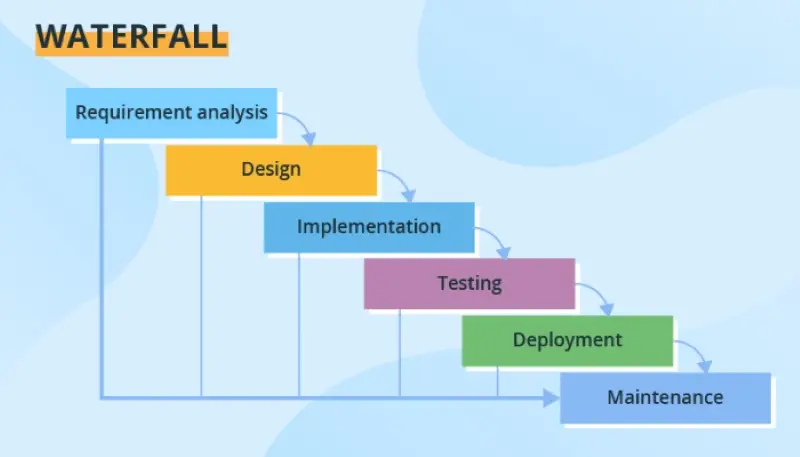

# ANALYSIS AND SYSTEM DESIGN

## 🤔System Analysis là gì?

**System Analysis (Phân tích hệ thống)** là giai đoạn đầu tiên trong quá trình phát triển hệ thống phần mềm hoặc hệ thống thông tin, tập trung vào việc hiểu rõ và làm rõ các yêu cầu của người dùng, cũng như xác định các vấn đề hiện có trong hệ thống hoặc các yêu cầu cho một hệ thống mới.

Mục tiêu của phân tích hệ thống là thu thập thông tin để xây dựng một cơ sở dữ liệu đầy đủ, từ đó có thể tạo ra một bản thiết kế chi tiết cho hệ thống.

### 📙Các bước chính trong phân tích hệ thống

#### 📘Thu thập yêu cầu (Requirements Gathering)

Mục tiêu: Hiểu rõ các yêu cầu của khách hàng, người dùng và các bên liên quan. Đây là bước cực kỳ quan trọng vì một khi yêu cầu được xác định rõ, các bước tiếp theo mới có thể tiến hành đúng đắn.

Phương pháp:
- Phỏng vấn: Tiếp xúc trực tiếp với người dùng, khách hàng hoặc các bên liên quan để lắng nghe những yêu cầu của họ.

- Khảo sát và bảng câu hỏi: Dùng để thu thập ý kiến từ nhiều người dùng về nhu cầu của họ đối với hệ thống.
  
- Quan sát: Quan sát người dùng làm việc với hệ thống hiện tại để hiểu rõ luồng công việc và các điểm yếu.

- Phân tích tài liệu: Nghiên cứu các tài liệu hiện có như biểu đồ, báo cáo, tài liệu kỹ thuật từ hệ thống hiện tại (nếu có).

#### 📘Phân tích hiện trạng (As-Is Analysis)

Mục tiêu: Xem xét hệ thống hiện tại (nếu có) để hiểu cách nó hoạt động, các điểm mạnh và yếu, cũng như những hạn chế. Điều này giúp xác định những cải tiến cần thiết và cung cấp bối cảnh cho hệ thống mới.

Phân tích các quy trình công việc (workflow): Phân tích quy trình hiện tại trong tổ chức hoặc trong hệ thống hiện tại để xem xét các điểm cần cải thiện hoặc hợp lý hóa.

Phân tích vấn đề: Tìm ra nguyên nhân gốc rễ của các vấn đề hiện tại, chẳng hạn như quy trình chậm, sai sót hoặc rủi ro bảo mật.

#### 📘Xác định các yêu cầu chức năng và phi chức năng (Functional and Non-functional Requirements)

**Yêu cầu chức năng**: Là những gì mà hệ thống phải thực hiện (các tính năng hoặc chức năng). Ví dụ: hệ thống phải cho phép người dùng đăng nhập, tìm kiếm sản phẩm, thực hiện giao dịch mua.

**Yêu cầu phi chức năng**: Là các yêu cầu liên quan đến hiệu suất, bảo mật, khả năng mở rộng, tính dễ sử dụng, độ tin cậy, v.v. Ví dụ: hệ thống phải có thời gian phản hồi dưới 2 giây khi thực hiện tìm kiếm.

#### 📘Mô hình hóa hệ thống (System Modeling)

Mục tiêu: Tạo các mô hình biểu diễn cách hệ thống hoạt động dựa trên các yêu cầu đã thu thập. Mô hình hóa giúp dễ dàng hình dung và giao tiếp về hệ thống.

Các công cụ và sơ đồ mô hình:
- **Sơ đồ Use Case (Use Case Diagrams)**: Mô tả các tương tác giữa người dùng và hệ thống thông qua các kịch bản sử dụng cụ thể (use cases).

- **Sơ đồ luồng dữ liệu (Data Flow Diagrams - DFD)**: Mô tả cách dữ liệu di chuyển trong hệ thống.

- **Sơ đồ quan hệ thực thể (Entity-Relationship Diagram - ERD)**: Mô tả cấu trúc của dữ liệu, các thực thể và mối quan hệ giữa chúng.

- **Sơ đồ hoạt động (Activity Diagrams)**: Mô tả quy trình xử lý công việc, cho thấy dòng công việc hoặc cách các chức năng được thực hiện.

#### 📘Phân tích khả thi (Feasibility Study)

Mục tiêu: Đánh giá tính khả thi của dự án từ nhiều khía cạnh khác nhau. Điều này giúp xác định xem hệ thống có thể được xây dựng với các yêu cầu và ràng buộc hiện tại hay không.

Các loại khả thi:
- Khả thi kỹ thuật: Đánh giá xem các công nghệ hiện có có đủ để phát triển hệ thống hay không.

- Khả thi tài chính: Đánh giá chi phí phát triển hệ thống có nằm trong ngân sách không và có mang lại lợi ích kinh tế hay không.

- Khả thi vận hành: Đánh giá xem hệ thống có phù hợp với quy trình làm việc và người dùng hay không.

#### 📘Lập tài liệu yêu cầu (Requirements Documentation)

Mục tiêu: Ghi chép toàn bộ các yêu cầu đã thu thập và phân tích trong một tài liệu chính thức (có thể là tài liệu đặc tả yêu cầu – SRS).

**Tài liệu yêu cầu hệ thống (System Requirements Specification - SRS)**: Đây là một tài liệu chi tiết về mọi yêu cầu chức năng và phi chức năng, bao gồm tất cả các ràng buộc kỹ thuật, khả thi và phương pháp để đạt được mục tiêu.

#### 📘Xác nhận yêu cầu (Requirements Validation)

Mục tiêu: Đảm bảo rằng tất cả các yêu cầu đã được ghi nhận chính xác và phù hợp với nhu cầu của các bên liên quan. Đây là quá trình lặp lại, đòi hỏi sự đồng thuận từ khách hàng và người dùng trước khi bước sang giai đoạn thiết kế.

Hoạt động kiểm tra và xác nhận: Thảo luận lại với người dùng, kiểm tra với các chuyên gia hoặc thậm chí xây dựng các mẫu thử (prototype) để đảm bảo rằng yêu cầu là đúng và khả thi.

### 📙Các phương pháp và kỹ thuật hỗ trợ

**Phân tích hướng đối tượng (Object-Oriented Analysis - OOA)**: Sử dụng các khái niệm hướng đối tượng như đối tượng, lớp, thuộc tính, phương thức để mô hình hóa hệ thống.

**Phân tích chức năng (Functional Decomposition)**: Phân chia hệ thống thành các thành phần hoặc chức năng nhỏ hơn để hiểu rõ từng phần và quản lý tốt hơn.

**Use Case Analysis**: Xác định và mô tả các tình huống sử dụng hệ thống từ góc nhìn của người dùng cuối (actor), giúp hiểu rõ cách hệ thống được sử dụng.

### 📙Tổng kết (ý kiến KhoiLee)

Khi phân tích hệ thống cần trả lời các cấu hỏi:
- Hệ thống cần đáp ứng được những yêu cầu gì?
- Điểm mạnh, yếu và hạn chế của hệ thống?
- Hệ thống cần có chức năng gì?
- Độ bảo mật và hiệu năng của hệ thống?
- Mô hình của hệ thống?
- Hệ thống sử dụng những công cụ, công nghệ gì?
- Hệ thống được sử dụng và vận hành ra sao?

## 🤔System Design là gì?

**System Design (Thiết kế hệ thống)** là giai đoạn tiếp theo sau khi hoàn tất việc phân tích hệ thống. Trong giai đoạn này, chuyển đổi các yêu cầu của hệ thống đã được phân tích thành một kiến trúc chi tiết, chỉ rõ cách hệ thống sẽ được xây dựng, tổ chức và hoạt động.

Thiết kế hệ thống không chỉ giúp đảm bảo rằng hệ thống sẽ đáp ứng được các yêu cầu chức năng và phi chức năng, mà còn tạo cơ sở cho đội ngũ phát triển triển khai hệ thống một cách hiệu quả.

### 📙Các bước chính trong thiết kế hệ thống

#### 📘Thiết kế kiến trúc hệ thống (System Architecture Design)

Mục tiêu: Xác định cách toàn bộ hệ thống sẽ được tổ chức về mặt cấu trúc và cách các thành phần chính sẽ tương tác với nhau.

Các quyết định kiến trúc chính:
- **Kiến trúc phân lớp (Layered Architecture)**: Hệ thống được chia thành nhiều lớp khác nhau, mỗi lớp có trách nhiệm riêng biệt (ví dụ: giao diện người dùng, logic nghiệp vụ, cơ sở dữ liệu).

- **Client-Server**: Xác định hệ thống sẽ hoạt động theo mô hình máy khách-máy chủ, trong đó các thành phần máy khách (client) tương tác với máy chủ (server).

- **Microservices**: Hệ thống có thể được chia thành các dịch vụ nhỏ, độc lập, mỗi dịch vụ đảm nhiệm một chức năng cụ thể và giao tiếp với nhau qua API.

- **Monolithic**: Một hệ thống nguyên khối, trong đó mọi thành phần được tích hợp chặt chẽ với nhau.

> bổ sung các kiến trúc

#### 📘Thiết kế chi tiết các thành phần (Detailed Component Design)

Mục tiêu: Phân chia hệ thống thành các module hoặc thành phần nhỏ hơn, mỗi thành phần có trách nhiệm riêng biệt và dễ quản lý.

Thiết kế module: Mỗi module sẽ đảm nhiệm một nhiệm vụ cụ thể, ví dụ: module đăng nhập, module quản lý người dùng, module xử lý thanh toán, v.v.

Thiết kế interface giữa các module: Định nghĩa cách các module tương tác với nhau, thông qua các giao diện rõ ràng (API, giao thức truyền thông, v.v.).

#### 📘Thiết kế giao diện người dùng (User Interface Design)

Mục tiêu: Xác định cách người dùng sẽ tương tác với hệ thống thông qua các màn hình, nút bấm, biểu mẫu, và các yếu tố giao diện khác.

Quy trình: Bao gồm tạo các mẫu thử (wireframes) hoặc mô hình mẫu (prototypes) của giao diện người dùng, dựa trên các yêu cầu từ phân tích hệ thống.

Nguyên tắc thiết kế UI/UX: Thiết kế phải dễ sử dụng, thân thiện với người dùng, đảm bảo tính trực quan và đáp ứng yêu cầu về tính năng.

#### 📘Thiết kế cơ sở dữ liệu (Database Design)

Mục tiêu: Xác định cách dữ liệu sẽ được lưu trữ, truy cập và quản lý trong hệ thống.

Các bước chính:
- **Thiết kế mô hình dữ liệu (Data Modeling)**: Sử dụng các **sơ đồ quan hệ thực thể** (ERD - Entity Relationship Diagram) để mô tả cấu trúc của cơ sở dữ liệu, xác định các bảng, thực thể, thuộc tính và mối quan hệ giữa chúng.

- **Bình thường hóa dữ liệu (Normalization)**: Đảm bảo rằng dữ liệu được tổ chức một cách hiệu quả và tránh sự trùng lặp không cần thiết.

- **Thiết kế lược đồ cơ sở dữ liệu**: Xác định cách dữ liệu sẽ được lưu trữ trong các bảng, chỉ mục, khóa chính và khóa ngoại, cùng với việc lựa chọn công cụ cơ sở dữ liệu (SQL Server, MongoDB, v.v.).

#### 📘Thiết kế bảo mật (Security Design)

Mục tiêu: Đảm bảo rằng hệ thống có thể bảo vệ dữ liệu và ngăn chặn các cuộc tấn công.

Các phương pháp bảo mật:
- Quản lý quyền truy cập: Sử dụng các cơ chế như kiểm soát truy cập dựa trên vai trò (**Role-Based Access Control - RBAC**) để giới hạn quyền truy cập vào các chức năng hệ thống khác nhau.

- Mã hóa dữ liệu: Sử dụng mã hóa để bảo vệ dữ liệu khi lưu trữ và truyền tải.

- Xác thực và ủy quyền: Sử dụng cơ chế xác thực mạnh (như **OAuth**, **JWT**) để đảm bảo chỉ những người dùng hợp lệ mới có quyền truy cập vào hệ thống.

> bổ sung OAuth, JWT

#### 📘Thiết kế các quy trình và thuật toán (Process and Algorithm Design)

Mục tiêu: Xác định các quy trình nội bộ và thuật toán cần thiết để thực hiện các chức năng của hệ thống.

Ví dụ: Nếu hệ thống có chức năng tìm kiếm, thuật toán tìm kiếm cần được thiết kế. Nếu có các luồng xử lý phức tạp (như quy trình đặt hàng, xử lý thanh toán), các bước chi tiết phải được xác định rõ ràng.

Mô hình hóa quy trình: **Sử dụng sơ đồ luồng công việc (workflow diagram)** hoặc **sơ đồ hoạt động (activity diagram)** để mô tả các bước và quy trình thực hiện.

#### 📘Thiết kế tích hợp và giao tiếp (Integration and Communication Design)

Mục tiêu: Xác định cách các thành phần khác nhau trong hệ thống sẽ giao tiếp và tương tác với nhau, hoặc với các hệ thống bên ngoài.

Các quyết định chính:
- API: Định nghĩa các API hoặc giao diện dịch vụ web (RESTful, SOAP) để các thành phần hoặc hệ thống khác có thể giao tiếp.

- Message Queue hoặc Event Bus: Sử dụng các cơ chế như message queue (RabbitMQ, Kafka) để quản lý việc giao tiếp không đồng bộ giữa các thành phần.

> bổ sung chi tiết

### 📙Các mô hình trong thiết kế hệ thống

**UML (Unified Modeling Language)**: UML là công cụ phổ biến được sử dụng để mô hình hóa hệ thống trong giai đoạn thiết kế. UML bao gồm nhiều loại sơ đồ giúp mô tả chi tiết các khía cạnh khác nhau của hệ thống:

- Sơ đồ lớp (Class Diagram): Mô tả các lớp đối tượng, thuộc tính và mối quan hệ giữa chúng.

- Sơ đồ trình tự (Sequence Diagram): Mô tả trình tự các tương tác giữa các đối tượng trong hệ thống theo thời gian.

- Sơ đồ trạng thái (State Diagram): Mô tả các trạng thái khác nhau của một đối tượng và các sự kiện gây ra sự thay đổi trạng thái.

- Sơ đồ hoạt động (Activity Diagram): Mô tả luồng công việc hoặc các bước trong một quy trình.

### 📙Tổng kết (ý kiến KhoiLee)

Khi thiết kế hệ thống cần xác định được:
- Hệ thống tổ trúc theo kiến trúc gì?
- Hệ thống có những module, interface nào?
- Người dùng thao tác như thế nào (trải nghiệm người dùng)?
- Tổ chức dữ liệu trong hệ thống (cơ sở dữ liệu)
- Hệ thống được phân quyền và mã hóa dữ liệu ra sao?

## 📚Quy trình phát triển hệ thống SDLC (Software Development Life Cycle)

**Software Development Life Cycle (SDLC)**, hay Quy trình phát triển phần mềm, là một quy trình có cấu trúc để phát triển phần mềm, bao gồm nhiều giai đoạn từ việc lập kế hoạch đến triển khai và bảo trì. SDLC giúp đảm bảo rằng phần mềm được phát triển đúng yêu cầu, đạt chất lượng và dễ bảo trì. Quy trình này còn giúp giảm thiểu rủi ro, tiết kiệm chi phí, và cải thiện hiệu suất làm việc của đội ngũ phát triển.

### 📙Các giai đoạn chính của SDLC

#### 📘Lập kế hoạch (Planning)

Mục tiêu: Xác định phạm vi và mục tiêu của dự án, cũng như lên kế hoạch tổng thể về nguồn lực, thời gian và chi phí.

Các hoạt động chính:
- Xác định các yêu cầu sơ bộ của dự án.

- Đánh giá tính khả thi (feasibility study), bao gồm khả thi kỹ thuật, tài chính, vận hành và thời gian.

- Xây dựng lịch trình dự án và dự toán ngân sách.

- Thiết lập đội ngũ phát triển, quản lý rủi ro và chuẩn bị tài liệu dự án.

#### 📘Phân tích yêu cầu (Requirement Analysis)

Mục tiêu: Hiểu rõ và thu thập tất cả các yêu cầu từ phía khách hàng và các bên liên quan để xác định chức năng mà hệ thống cần phải có.

Các hoạt động chính:
- Thu thập yêu cầu từ người dùng, khách hàng và các bên liên quan thông qua phỏng vấn, khảo sát, và nghiên cứu tài liệu.

- Phân tích các yêu cầu chức năng (Functional Requirements) và phi chức năng (Non-functional Requirements).

- Tạo tài liệu đặc tả yêu cầu phần mềm (SRS - Software Requirements Specification) để ghi chép chi tiết các yêu cầu.

#### 📘Thiết kế hệ thống (System Design)

Mục tiêu: Chuyển các yêu cầu đã phân tích thành bản thiết kế chi tiết, bao gồm thiết kế kiến trúc hệ thống và thiết kế chi tiết cho các thành phần.

Các hoạt động chính:
- Thiết kế kiến trúc tổng thể của hệ thống, xác định các thành phần, module, và mối quan hệ giữa chúng.

- Thiết kế cơ sở dữ liệu, giao diện người dùng, quy trình làm việc, và các thuật toán cần thiết.

- Tạo ra các mô hình UML, sơ đồ ERD, và các bản vẽ chi tiết để thể hiện cách hệ thống sẽ hoạt động.

- Đảm bảo tính bảo mật, hiệu suất, và khả năng mở rộng trong thiết kế.

#### 📘Phát triển/triển khai (Development/Implementation)

Mục tiêu: Xây dựng hệ thống dựa trên thiết kế đã được phê duyệt.

Các hoạt động chính:
- Lập trình các thành phần của hệ thống, bao gồm các module, giao diện người dùng, cơ sở dữ liệu và tích hợp các dịch vụ.

- Sử dụng các công nghệ, ngôn ngữ lập trình, công cụ và frameworks phù hợp.

- Đảm bảo rằng các mã nguồn tuân theo các chuẩn mã hóa và yêu cầu kỹ thuật.

- Đặt nền móng cho việc kiểm thử (testing), như việc viết các trường hợp kiểm thử tự động (unit tests).

#### 📘Kiểm thử (Testing)

Mục tiêu: Đảm bảo rằng phần mềm hoạt động chính xác, không có lỗi và đáp ứng các yêu cầu đề ra.

Các hoạt động chính:
- Thực hiện các loại kiểm thử khác nhau như **kiểm thử đơn vị (unit testing)**, **kiểm thử tích hợp (integration testing)**, **kiểm thử chức năng (functional testing)**, **kiểm thử hệ thống (system testing)**, và **kiểm thử chấp nhận người dùng (user acceptance testing - UAT)**.

- Kiểm tra hiệu suất, bảo mật và khả năng chịu tải của hệ thống.

- Ghi nhận và sửa các lỗi phát sinh.

- Kiểm thử hồi quy (regression testing) để đảm bảo rằng không có lỗi mới phát sinh sau khi sửa lỗi cũ.

#### 📘Triển khai (Deployment)

Mục tiêu: Đưa phần mềm vào môi trường sản xuất và giao cho người dùng cuối.

Các hoạt động chính:
- Chuẩn bị môi trường triển khai, có thể là trên máy chủ cục bộ hoặc trên nền tảng đám mây (cloud).

- Cài đặt và cấu hình phần mềm, cơ sở dữ liệu, và các thành phần cần thiết.

- Di chuyển dữ liệu (nếu có) từ hệ thống cũ sang hệ thống mới.

- Đảm bảo rằng phần mềm hoạt động tốt trên môi trường sản xuất.

- Đào tạo người dùng và cung cấp tài liệu hướng dẫn sử dụng.

#### 📘Bảo trì (Maintenance)

Mục tiêu: Duy trì, cải tiến và sửa chữa phần mềm sau khi triển khai.

Các hoạt động chính:
- Theo dõi hoạt động của phần mềm để phát hiện các lỗi hoặc sự cố.

- Cập nhật, vá lỗi và tối ưu hóa hiệu suất của phần mềm khi cần.

- Phát triển các tính năng mới dựa trên yêu cầu thay đổi của người dùng hoặc nhu cầu kinh doanh.

- Quản lý các bản phát hành, cập nhật và triển khai các thay đổi.

### 📙Các mô hình SDLC phổ biếnK

#### 📘Waterfall Model (Mô hình thác nước)

**Mô hình thác nước (Waterfall Model)** là một trong những mô hình phát triển phần mềm cổ điển, được gọi là "*thác nước*" vì quy trình phát triển chảy xuống theo từng giai đoạn, tương tự như dòng nước chảy qua từng bậc thác mà không quay lại các giai đoạn trước.

##### 📗Đặc điểm của Mô hình thác nước
**Tuần tự và tuyến tính**: Các giai đoạn trong mô hình thác nước được thực hiện theo trình tự, từng giai đoạn phải được hoàn thành trước khi chuyển sang giai đoạn tiếp theo.

**Không lặp lại**: Sau khi hoàn thành một giai đoạn, nhóm phát triển không quay lại chỉnh sửa các giai đoạn trước đó (trừ khi có lỗi lớn).

**Dễ dàng quản lý**: Mô hình có cấu trúc đơn giản, dễ hiểu, rõ ràng, và dễ kiểm soát do các bước diễn ra theo thứ tự cố định.

##### 📗Các giai đoạn trong Mô hình thác nước

Yêu cầu (Requirement Gathering and Analysis)
- Mục tiêu của giai đoạn này là thu thập và phân tích tất cả các yêu cầu từ người dùng và các bên liên quan để xác định chính xác các chức năng mà phần mềm cần có.

- Kết quả của giai đoạn này là một tài liệu đặc tả yêu cầu phần mềm (SRS - Software Requirements Specification).

Thiết kế hệ thống (System Design)
- Dựa trên tài liệu yêu cầu, nhóm phát triển sẽ thiết kế kiến trúc hệ thống và xác định các thành phần chính, giao diện, dữ liệu và quy trình làm việc.

- Tạo ra tài liệu thiết kế hệ thống, bao gồm các mô hình và sơ đồ chi tiết về kiến trúc, cơ sở dữ liệu và giao diện người dùng.

Phát triển (Implementation)
- Nhóm lập trình sẽ viết mã nguồn dựa trên thiết kế đã được phê duyệt, và các thành phần của hệ thống sẽ được xây dựng và tích hợp lại với nhau.

- Đây là giai đoạn thực thi thực tế, biến các yêu cầu và thiết kế thành mã nguồn.

Kiểm thử (Testing)
- Kiểm thử để phát hiện và sửa lỗi, đảm bảo phần mềm hoạt động đúng yêu cầu và không có lỗi phát sinh.

- Các loại kiểm thử bao gồm kiểm thử chức năng, kiểm thử hệ thống và kiểm thử chấp nhận người dùng.

Triển khai (Deployment)
- Sau khi kiểm thử hoàn tất, phần mềm sẽ được triển khai vào môi trường sản xuất để người dùng cuối có thể bắt đầu sử dụng.

- Các bước triển khai có thể bao gồm cài đặt phần mềm, đào tạo người dùng và chuyển giao dữ liệu.

Bảo trì (Maintenance)
- Đây là giai đoạn phần mềm đã đi vào hoạt động thực tế, và đội ngũ phát triển sẽ duy trì, cập nhật và sửa lỗi để đáp ứng các nhu cầu thay đổi của người dùng.

- Các hoạt động bảo trì bao gồm vá lỗi, cải tiến hiệu năng và nâng cấp tính năng.

##### 📗Khi nào nên sử dụng Mô hình thác nước

**Ưu điểm**: Dễ quản lý, quy trình rõ ràng, phù hợp với các dự án có yêu cầu ổn định.

**Nhược điểm**: Không linh hoạt khi có sự thay đổi yêu cầu trong quá trình phát triển, không phù hợp cho các dự án phức tạp.

Mô hình thác nước phù hợp nhất với các dự án:
- Có yêu cầu rõ ràng, ít thay đổi trong suốt quá trình phát triển.
- Quy mô nhỏ và không yêu cầu nhiều tương tác với người dùng trong suốt quá trình phát triển.
- Có thời gian hoàn thành cụ thể, không yêu cầu phát triển nhanh hoặc liên tục.

#### 📘Agile Model (Mô hình Agile)

Agile là một mô hình lặp lại và linh hoạt, với các chu kỳ phát triển ngắn (iteration hoặc sprint). Phản hồi từ khách hàng được thu thập liên tục để cải thiện sản phẩm.

##### 📗Đặc điểm của Mô hình Agile
**Linh hoạt và phản hồi nhanh**: Agile cho phép thay đổi yêu cầu kể cả khi dự án đang phát triển.

**Chu kỳ phát triển ngắn**: Dự án được phát triển theo từng phần nhỏ và mỗi phần có thể sử dụng ngay sau khi hoàn thành một vòng phát triển (sprint).

**Tương tác thường xuyên**: Sự cộng tác giữa nhóm phát triển và khách hàng diễn ra liên tục qua các cuộc họp và phản hồi thường xuyên.

**Phát triển theo hướng người dùng**: Tập trung vào các yêu cầu và phản hồi của người dùng cuối để đảm bảo sản phẩm thực sự hữu ích và phù hợp.

##### 📗Các giai đoạn của Mô hình Agile

Lập kế hoạch (Planning)
- Mục tiêu của giai đoạn này là xác định phạm vi và mục tiêu chung của dự án.

- Lên danh sách các yêu cầu ban đầu từ khách hàng và sắp xếp chúng theo thứ tự ưu tiên.

- Đội phát triển và khách hàng thảo luận về lịch trình phát triển và xác định các sprint đầu tiên.

Thiết kế yêu cầu và kế hoạch sprint (Requirements & Sprint Planning)
- Phân tích và xác định các tính năng cụ thể sẽ được hoàn thành trong sprint đầu tiên.

- Chuyển các yêu cầu của khách hàng thành các user stories (câu chuyện người dùng) và chia nhỏ chúng thành các tác vụ.

- Đội ngũ phát triển lên kế hoạch chi tiết cho sprint, xác định các nhiệm vụ và thời gian hoàn thành.

Phát triển và kiểm thử (Development & Testing)
- Trong mỗi sprint, đội ngũ phát triển xây dựng, kiểm thử, và tích hợp các tính năng theo từng user story.

- Thực hiện kiểm thử tự động và kiểm thử thủ công để đảm bảo các tính năng hoạt động đúng yêu cầu.

- Mỗi lần hoàn thành sprint, nhóm phát triển sẽ có một sản phẩm hoàn chỉnh, có thể chạy và sử dụng.

Gặp gỡ đánh giá sprint (Sprint Review)
- Cuối mỗi sprint, nhóm phát triển tổ chức buổi gặp gỡ với khách hàng để trình bày những tính năng đã hoàn thành.

- Khách hàng kiểm tra và đưa ra phản hồi cho nhóm phát triển, từ đó định hướng cho sprint tiếp theo.

Sprint Retrospective (Đánh giá nội bộ)
- Sau mỗi sprint, đội ngũ phát triển họp nội bộ để đánh giá và rút kinh nghiệm về quy trình, công việc, và hiệu suất làm việc.

- Nhóm xác định các vấn đề đã gặp phải và đề xuất các cải tiến cho các sprint sau.

Triển khai và phát hành (Deployment & Release)
- Sau một số sprint hoặc khi đạt được một mốc quan trọng, nhóm phát triển sẽ triển khai phiên bản phần mềm cho khách hàng sử dụng rộng rãi.

- Tiến hành triển khai trong môi trường thực tế và tiếp tục duy trì, cập nhật phần mềm dựa trên phản hồi của người dùng.

##### 📗Các nguyên tắc chính của Agile

Agile được xây dựng dựa trên **4 giá trị cốt lõi** và **12 nguyên tắc** từ "Manifesto for Agile Software Development". Các nguyên tắc nổi bật:

- **Ưu tiên cao nhất** là đáp ứng yêu cầu của khách hàng thông qua phần mềm hữu ích, có giá trị.

- **Tiếp nhận sự thay đổi** của yêu cầu dù dự án đã đi vào phát triển.

- **Cung cấp phần mềm khả dụng** qua các chu kỳ ngắn, thường xuyên từ vài tuần đến vài tháng.

- **Sự hợp tác chặt chẽ** giữa khách hàng và đội ngũ phát triển.

- **Động lực của nhóm phát triển** là yếu tố quan trọng, tin tưởng và hỗ trợ lẫn nhau.

- **Giao tiếp trực tiếp** và thường xuyên để giảm bớt hiểu lầm.

- **Phần mềm hoạt động được** là thước đo chính cho sự tiến bộ.

- **Phát triển bền vững**: Đảm bảo nhịp độ phát triển ổn định.

- **Nâng cao kỹ thuật** và thiết kế tốt để tăng tính linh hoạt và duy trì lâu dài.

- **Tự tổ chức**: Đội ngũ phát triển tự chủ và trách nhiệm trong việc đưa ra quyết định.

- **Đánh giá thường xuyên** để điều chỉnh và tối ưu hóa quy trình.

##### 📗Các mô hình và framework Agile

Scrum
Scrum là một trong những framework phổ biến nhất của Agile, sử dụng các sprint ngắn từ 2-4 tuần để phát triển phần mềm.

Tập trung vào các cuộc họp hàng ngày (Daily Standup), các vai trò rõ ràng (Scrum Master, Product Owner, và Development Team), và các cuộc họp đánh giá sprint và retrospective.

Kanban:

Kanban sử dụng bảng và thẻ để quản lý các tác vụ trong quy trình phát triển, giúp theo dõi tiến độ của các công việc.

Thích hợp cho các dự án cần sự linh hoạt cao, không có chu kỳ cố định.

Extreme Programming (XP):

XP là một phương pháp tập trung mạnh vào các nguyên tắc lập trình như phát triển dựa trên test (TDD), lập trình đôi (pair programming), và tích hợp liên tục (continuous integration).

Thích hợp cho các dự án có nhu cầu cao về chất lượng và độ chính xác.

Lean Software Development:

Lean tập trung vào việc tối ưu hóa quy trình để giảm lãng phí và tăng hiệu quả.

Các nguyên tắc của Lean bao gồm việc giảm thiểu các công việc không cần thiết và chỉ tập trung vào giá trị khách hàng.

##### 📗Khi nào nên sử dụng Mô hình Agile

**Ưu điểm**: Thích ứng nhanh với sự thay đổi, thúc đẩy sự hợp tác liên tục giữa các bên liên quan.

**Nhược điểm**: Khó lập kế hoạch dài hạn và yêu cầu sự cam kết liên tục từ cả đội ngũ phát triển và khách hàng.

Agile là lựa chọn phù hợp cho các dự án:
- Có yêu cầu và mục tiêu dễ thay đổi, không cố định.
- Cần sự phản hồi liên tục từ khách hàng và người dùng.
- Đòi hỏi thời gian hoàn thành ngắn và yêu cầu linh hoạt cao.
- Đòi hỏi chất lượng sản phẩm cao và dễ dàng cải tiến trong quá trình phát triển.

#### 📘V-Model (Mô hình V):

Mô hình V là một biến thể của mô hình thác nước, trong đó mỗi giai đoạn phát triển tương ứng với một giai đoạn kiểm thử. Việc kiểm thử diễn ra song song với các giai đoạn phát triển.
Ưu điểm: Tập trung mạnh vào kiểm thử, giúp phát hiện lỗi sớm.
Nhược điểm: Thiếu tính linh hoạt khi có thay đổi trong yêu cầu.

#### 📘Spiral Model (Mô hình xoắn ốc):

Mô hình này kết hợp các yếu tố của cả mô hình thác nước và mô hình lặp. Nó nhấn mạnh vào việc quản lý rủi ro, với các chu kỳ lặp lại và đánh giá liên tục.
Ưu điểm: Tập trung vào việc giảm thiểu rủi ro, thích hợp với các dự án lớn, phức tạp.
Nhược điểm: Tốn kém và đòi hỏi kỹ năng cao từ đội ngũ quản lý rủi ro.

#### 📘Iterative Model (Mô hình lặp):

Mô hình này tập trung vào việc phát triển qua nhiều chu kỳ lặp đi lặp lại, cho phép cải thiện phần mềm qua từng vòng lặp.

Ưu điểm: Dễ dàng điều chỉnh và cải tiến sản phẩm.
Nhược điểm: Yêu cầu sự quản lý tốt và có thể tăng chi phí nếu không kiểm soát tốt.

## 📚System Requirements Specification - SRS

**SRS** là viết tắt của Software Requirements Specification, có nghĩa là Tài liệu Yêu cầu Phần mềm. Đây là một tài liệu quan trọng trong quá trình phát triển phần mềm, mô tả các yêu cầu chức năng và phi chức năng của phần mềm cần được phát triển.

### 📙Thành phần trong SRS

Giới thiệu
- Mục tiêu hệ thống: Giải thích mục đích tổng thể của hệ thống và lý do tại sao hệ thống được xây dựng.
- Phạm vi: Định nghĩa các giới hạn của hệ thống, những gì sẽ và sẽ không được thực hiện.
- Tài liệu tham khảo: Các tài liệu, tiêu chuẩn, và quy định cần tuân theo trong quá trình phát triển.

Yêu cầu chức năng
- Liệt kê các tính năng mà hệ thống phải có để đáp ứng nhu cầu người dùng. Mỗi yêu cầu chức năng được mô tả chi tiết cùng với các kịch bản, trường hợp sử dụng (use case), và cách người dùng sẽ tương tác với hệ thống.

Yêu cầu phi chức năng
- Hiệu suất: Thời gian phản hồi, tốc độ xử lý.
- Bảo mật: Cách hệ thống bảo vệ dữ liệu và truy cập.
- Khả năng bảo trì: Yêu cầu liên quan đến bảo trì và nâng cấp hệ thống.
- Khả năng mở rộng: Cách hệ thống dễ dàng thích ứng với sự gia tăng người dùng hoặc dữ liệu.

Yêu cầu giao diện người dùng
- Cung cấp các bản phác thảo giao diện, nguyên tắc thiết kế giao diện và mô tả cách người dùng sẽ tương tác với hệ thống.

Các yêu cầu về phần cứng/phần mềm và môi trường hệ thống
- Các yêu cầu về phần cứng, hệ điều hành, và các thành phần phần mềm liên quan cần thiết để chạy hệ thống.

Các quy định và chính sách
- Các yêu cầu pháp lý, bảo mật và các quy định khác mà hệ thống cần tuân thủ.

*❗Tùy theo trường hợp và hệ thống cụ thể mà các thành phần có thể thay đổi*

Ví dụ: SRS khi xây dựng game có thể có

Giới thiệu
- Tầm nhìn và mục tiêu: Xác định rõ loại game (game hành động, phiêu lưu, nhập vai, v.v.), mục tiêu phát triển, và tầm nhìn tổng thể cho game.
- Đối tượng người chơi: Đặc tả nhóm người chơi mục tiêu (độ tuổi, sở thích, kinh nghiệm chơi game) để đảm bảo thiết kế game phù hợp với người chơi.
- Phạm vi: Giới hạn của dự án và các tính năng sẽ phát triển cho phiên bản này, giúp xác định rõ các tính năng cần có và các tính năng sẽ được triển khai ở phiên bản sau (nếu có).

Yêu cầu chức năng
- Cơ chế gameplay: Đặc tả các cơ chế chính như di chuyển, chiến đấu, thu thập vật phẩm, xây dựng, hoặc các hoạt động người chơi sẽ thực hiện.
Cốt truyện và bối cảnh: Mô tả chi tiết về cốt truyện, thế giới game, các chương hồi, và bối cảnh của từng màn chơi.
- Nhân vật và AI:
    - Nhân vật chính: Thông tin về nhân vật chính bao gồm khả năng, kỹ năng, trang bị, và quá trình phát triển của nhân vật.
    - Đối thủ và NPC: Các mô tả về đối thủ, AI của nhân vật phụ (NPC), hành vi, cách phản ứng, và vai trò trong game.
- Hệ thống nhiệm vụ và tiến trình: Hệ thống nhiệm vụ, các mục tiêu của từng màn chơi, phần thưởng khi hoàn thành, và các yếu tố kích thích người chơi tiến xa hơn.
- Giao diện người dùng (UI): Thiết kế các màn hình và yếu tố giao diện như thanh máu, bản đồ nhỏ, điểm số, và menu điều khiển.

Yêu cầu phi chức năng
- Hiệu suất: Mức yêu cầu về tốc độ khung hình (FPS), độ trễ tối đa, và yêu cầu để game có trải nghiệm mượt mà.
- Khả năng tương thích: Đảm bảo game chạy tốt trên các thiết bị mục tiêu (PC, console, điện thoại di động, v.v.).
- Khả năng mở rộng và bảo trì: Cấu trúc code dễ dàng nâng cấp, khả năng thêm tính năng mới trong tương lai mà không gây ảnh hưởng đến hiệu suất.

Thiết kế đồ họa và âm thanh
- Đồ họa: Mô tả phong cách nghệ thuật, độ phân giải, yêu cầu về mô hình 3D hoặc 2D, ánh sáng, và các hiệu ứng hình ảnh.
- Âm thanh: Yêu cầu về âm nhạc, hiệu ứng âm thanh, giọng nói nhân vật và cách thức âm thanh hòa hợp với cốt truyện và bối cảnh game.

Yêu cầu về cốt truyện và nội dung
- Cốt truyện chi tiết: Bao gồm mô tả chi tiết về bối cảnh, sự phát triển của cốt truyện, các sự kiện chính, và mục tiêu của người chơi.
- Thiết kế thế giới game: Bản đồ của các khu vực, môi trường và cách bố trí từng khu vực (rừng, sa mạc, thành phố v.v.), bao gồm các yếu tố ảnh hưởng đến gameplay như địa hình và khí hậu.
- Mức độ và tiến trình: Chi tiết các cấp độ (level), cách người chơi tiến bộ, và điều kiện để người chơi chuyển qua các cấp độ hoặc vùng chơi khác.

Quy trình kiểm thử
- Kế hoạch kiểm thử: Cách thức kiểm tra các tính năng và cơ chế game, bao gồm kiểm thử chức năng, hiệu suất và khả năng tương thích.
- Kịch bản kiểm thử: Các tình huống kiểm thử để đảm bảo các tính năng hoạt động đúng như mô tả.
- Thử nghiệm người chơi: Kế hoạch thu thập phản hồi từ nhóm người chơi thử nghiệm để tối ưu hóa trải nghiệm chơi.

Yêu cầu hệ thống
- Yêu cầu phần cứng: Đặc tả yêu cầu phần cứng tối thiểu và đề xuất để game hoạt động tốt.
- Yêu cầu phần mềm và công nghệ: Các công nghệ sử dụng để phát triển game, như công cụ game engine (Unity, Unreal Engine), ngôn ngữ lập trình, phần mềm mô hình hóa đồ họa, và hệ thống quản lý phiên bản.

An ninh và bảo mật
- Bảo vệ dữ liệu người chơi: Đặc tả phương pháp bảo vệ dữ liệu cá nhân và thông tin người chơi, nhất là đối với game online.
- Ngăn chặn gian lận: Yêu cầu các biện pháp ngăn chặn gian lận hoặc hack trong game.

Phụ lục
- Biểu đồ UML và sơ đồ hệ thống: Biểu đồ lớp, sơ đồ hoạt động, hoặc sơ đồ trình tự để làm rõ cấu trúc và logic của game.
- Tài liệu tham khảo và từ điển thuật ngữ: Giải thích các thuật ngữ chuyên ngành, ký hiệu và các tài liệu tham khảo khác giúp hiểu rõ hơn về hệ thống.

### 📙Phân biệt tài liệu SRS với BRD, FRS

| Loại tài liệu                           | Giải thích                                                                                                                                                                                                                                                                                                                 |
| --------------------------------------- | -------------------------------------------------------------------------------------------------------------------------------------------------------------------------------------------------------------------------------------------------------------------------------------------------------------------------- |
| SRS (System Requirements Specification) | Mô tả chi tiết yêu cầu cho phần mềm, tập trung vào các yêu cầu chức năng và phi chức năng của hệ thống, bao gồm cả các yêu cầu về dữ liệu, giao diện và hành vi của phần mềm. Tài liệu SRS thường được sử dụng bởi các nhà phát triển phần mềm để hiểu và triển khai yêu cầu của dự án.                                    |
| BRD (Business Requirement Document)     | Mô tả các yêu cầu kinh doanh và mục tiêu của doanh nghiệp, ttập trung vào các yêu cầu cấp cao hơn, bao gồm cả các yêu cầu về chiến lược, tầm nhìn, mục tiêu kinh doanh và yêu cầu của người dùng cuối. Tài liệu BRD thường được sử dụng để phân tích và thiết kế các giải pháp phần mềm để đáp ứng các yêu cầu kinh doanh. |
| FSD (Functional Specification Document) | Mô tả chi tiết các yêu cầu chức năng của hệ thống, tập trung vào các yêu cầu cụ thể về chức năng của phần mềm, bao gồm cả các yêu cầu về luồng công việc, quy trình và tương tác giữa các thành phần của hệ thống. Tài liệu FRS thường được sử dụng để triển khai và kiểm tra các chức năng của phần mềm.                  |

## 📚Phân tích Yêu cầu Hệ thống
### Yêu cầu chức năng và phi chức năng
### Use Case Diagrams
### User Stories
### MoSCoW Prioritization

## BFD (Business Function Diagram)

## DFD (Data Flow Diagram)

## Lucidchart, Microsoft Visio

## Thiết kế Hệ thống Hướng Đối Tượng (OOAD)
### Khái niệm OOP (Object-Oriented Programming): Các nguyên lý hướng đối tượng như Encapsulation, Inheritance, Polymorphism, và Abstraction.
### Phân tích hướng đối tượng
### Class Diagrams, Sequence Diagrams, State Diagrams

## UML (Unified Modeling Language)
### Use Case Diagrams
### Class Diagrams
### Sequence Diagrams
### Enterprise Architect, Visual Paradigm.

## Thiết kế Cơ sở Dữ liệu
### ERD (Entity-Relationship Diagram)
### Chuẩn hóa cơ sở dữ liệu

## Thiết kế Giao diện Người dùng (UI/UX)
### Nguyên lý thiết kế giao diện
### Wireframing và Prototyping
### Figma, Adobe XD.

## Kiểm thử và Đánh giá Hệ thống
### Unit Testing
### Integration Testing
### User Acceptance Testing (UAT)

## Quản lý Dự án và Phát triển Phần mềm
### Agile/Scrum
### Kanban
### JIRA, Trello.

