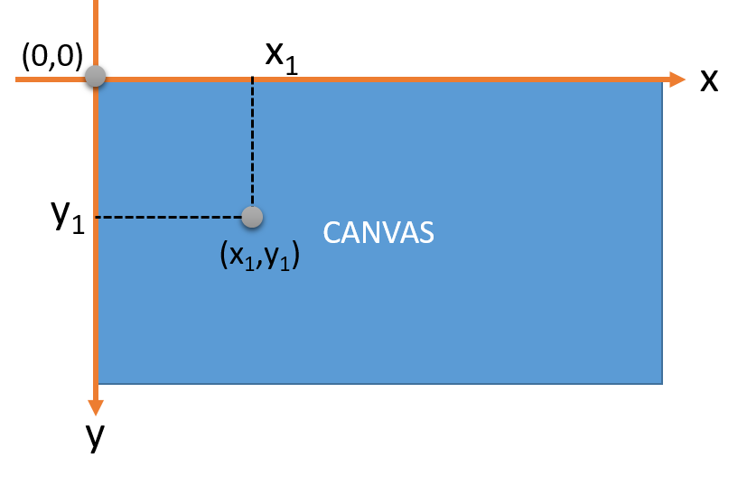

# ❗ Hình dung cơ bản

- HTML là khung sường
- CSS là trang trí, phong cách
- JavaScript là tính năng

# HTML

## 🤔HTML là gì?

**HTML** viết tắt của chữ **HyperText Markup Language** (ngôn ngữ đánh dấu siêu văn bản), nó được dùng để tạo ra các tài liệu hiện thị được trên trình duyệt

HTML sử dụng cách đánh dấu (markup) để chú thích cho các thành phần (phần tử HTML) như văn bản, hình ảnh ... các phần tử HTML tạo thành trang tài liệu hiện thị được trong các trình duyệt. Có rất nhiá»u phần tử HTML như: `<p>`, `<a>`, ``, `<title>`, `<body>`, ...

_❗Chỉ nội dung chứ không thi hành tác vụ, không phải là ngôn ngữ lập trình_

## 🤔Web tĩnh là gì?

Các tài liệu HTML (trang HTML) có thể là các file (thường có phần mở rộng .html, .htm) được lưu trữ trên hệ thống file của máy chủ web (webserver), từ đó trình duyệt truy cập đọc được và hiện thị.

## 🤔Trang web động là gì?

Các trang HTML mà trình duyệt lấy về từ webserver được phát sinh bởi một ứng dụng chạy trên server (ứng dụng phát triển bằng các ngôn ngữ lập trình như PHP, C# ...).

## 🤔Siêu văn bản (HyperText) là gì?

Ám chỉ sự liên kết giữa các trang, một trang HTML có liên kết tham chiếu đến một trang khác trên cùng một Website hay giữa các website.

## 📚Thẻ (Tag)

Ngôn ngữ đánh dấu HTML nghĩa là sử dụng các **thẻ(tag)** để tạo ra các phần tử nhằm hình thành cấu trúc tài liệu HTML

Một thẻ thì có tên thẻ (không phân biệt chữ hoa, thường), sau đó nó sử dụng quy tắc đánh dấu để tạo phần tử

```html
<tagname>Nội dung</tagname>
```

`<tagname>`: gọi là mở thẻ tagname (HTML có hàng trăm thẻ như a, p, i, img, table, ...), tùy thuộc vào loại thẻ mà có thể thiết lập thuộc tính cho phần tử HTML tạo ra

```html
<tagname thuoctinh1="giá-trị1" , thuoctinhn="giá trị n"></tagname>
```

`Nội dung`: Phần nội dung phần tử, tức là văn bản, hoặc các phần tử HTML khác nằm trong phần tử đang tạo ra.

`</tagname>`: Gọi là phần đóng thẻ HTML. Như vậy toàn bộ nội dung viết giữa mở thẻ và đóng thẻ nằm trong phần tử HTML tạo ra.

Có hai loại thẻ phân loại theo hình thức sử dụng

- Thẻ HTML chứa nội dung (có chứa nội dung, giữa mở thẻ và đóng thẻ, như thẻ `<p>`, `<title>`, `<h1>`, ...)

- Thẻ HTML rỗng (chỉ mở thẻ, không đóng thẻ, không chứa nội dung, ví dụ như thẻ `<br>`, ``, ... tuy nhiên thẻ vẫn có thuộc tính)

## 📚Thuộc tính

Các thuộc tính nhằm thiết lập thêm thông tin cho các thẻ (phần tử HTML). Hầu hết thuộc tính phần tử HTML thiết lập bằng tên thuộc tính và giá trị đi cùng với nó

Các thuộc tính của phần tử HTML viết tại tại vị trí mở thẻ, giữa ký hiệu `<tên-thẻ và ký hiệu >`. Thuộc tính viết theo cặp : *tên-thuộc-tính="giá trị"*

```html
<p align="center">Đoạn văn được căn giữa trang.</p>
```

## 📚Thuộc tính chung toàn cục

**Thuộc tính toàn cục (global attribute)** là các thuộc tính có thể đưa vào cho bất kỳ phần tử HTML nào, kể cả thuộc tính đó không có tác dụng gì với một số phần tử nhất định

Phần tử HTML khác nhau có thể có các thuộc tính khác nhau (thuộc tính này dùng được cho phần tử này nhưng chưa chắc đã dùng được cho phần tử khác). Do vậy, mỗi phần tử cần xem xét các thuộc tính riêng của nó

### 📙class

Thiết lập một hoặc nhiều tên lớp cho phần tử. Các lớp này được dùng để CSS, Javascript lựa chọn phần tử.

```html
<a href="https://xuanthulab.net" class="link1 link2">HTML</a>
```

### 📙style

Viết mã CSS áp dụng ngay cho phần tử. _Ví dụ phần tử P có cỡ chữ 18px (Đây là cách nhúng mã CSS dạng inline)_

```html
<p style="font-size: 18px">Inline style sheet</p>
```

### 📙id

Thiết lập một định danh duy nhất cho phần tử HTML. Định danh này để tìm kiếm chọn phần tử trong DOM, cũng như để lựa chọn trong CSS.

```html
<p id="idphantup">Ví dụ</p>
```

### 📙accesskey

Chỉ ra một phím tắt kích hoạt phần tử.

```html
<a href="https://xuanthulab.net" accesskey="x">HTML</a>
```

### 📙contenteditable

Cho biết nội dung trong phần tử có thể soạn thảo biên tập lại hay không. Nếu true thì sẽ xuất hiện box soạn thảo cho phần tử

```html
<p contenteditable="true">Nội dung này soạn thảo được</p>
```

### 📙data-\*

Thuộc tính thiết lập dữ liệu riêng cho phần tử, ký hiệu _ là một tên tự đặt. data-_ là chuẩn đặt tên thuộc tính dữ liệu dùng cho HTML5

Ví dụ phần tử đó có lưu một dữ liệu tên là abc, thì thuộc tính sẽ là data-abc. Sau này tại phần Javascript có thể đọc dữ liệu này theo tên abc, thông qua dataset của phần tử.

```html
<p data-abc="Đây là dữ liệu riêng">Ví dụ</p>
```

### 📙draggable

Cho biết phần tử có thể kéo thả không (true, false, auto). Thuộc tính này liên quan đến sử dụng Javascript truy cập API kéo/thả. Xem Kéo / Thả trong HTML5

```html
<p draggable="true">Ví dụ</p>
```

### 📙hidden

Khi có thuộc tính này phần tử sẽ ẩn, có thể gán bằng true/false

```html
<p hidden>Ví dụ</p>
```

### 📙spellcheck

Cho trình duyệt biết có kiểm tra ngữ pháp phần tử này hay không

```html
<p spellcheck="true">Có kiểm tra ngữ pháp</p>
```

### 📙title

Thông tin thêm về phần tử, ví dụ để chuột lên phần tử thì hiện thông tin này - nó là tooltip

```html
<p title="Thông tin thêm">Đây là đoạn văn</p>
```

### 📙autofocus

Thuộc tính autofocus, để kích hoạt phần tử (đang nhận nhập liệu từ bàn phím), thường dùng với các phần tử input, textarea trong FORM. Xem HTML Form

```html
<input name="ip" autofocus />
```

## 📚Mã ký tự HTML đặc biệt

Các ký tự đặc biệt ví dụ như > < " ... thì khi viết HTML hoặc CSS nhiều khi bạn phải sử dụng mã. Truy cập [Mã ký tự](https://www.w3schools.com/charsets/ref_utf_math.asp) để xem thêm.

_Ví dụ để viết HTML hiện thị: `<p>HTML</p>`_

```html
&lt;p&gt;HTML&lt;/p&gt;
```

_Ví dụ CSS ký tự © có mã CSS là \00A9_

```html
span { content:"\00A9"; }
```

## 📚Chú thích

Các chú thích trong HTML (comment) không hiện thị trên trình duyệt (trình duyệt bỏ qua), mục đích của chú thích là để mô tả, ghi chú, nhắc nhở về một đoạn mã nào đó để sau này đọc lại có thể hiểu nhanh chóng

```html
<!-- nội dung -->
```

## 📚Cấu trúc HTML

Một tài liệu (trang) HTML hoàn chỉnh có một thẻ gốc là `<html>`, mọi thẻ khác trình bày trong thẻ `<html>` này.

Trước thẻ `<html>` có đoạn text xác định nó là tài liệu HTML và phiên bản HTML

```html
<!DOCTYPE html>
<html>
  <head>
    <title>Khoi ne!</title>
    <meta charset="UTF-8" />
  </head>
  <body></body>
</html>
```

## 📚Thẻ head

Thẻ `<head>` chứa các thành phần (phần tử HTML) hầu như là không hiện thị tới người dùng, chúng là các điều khiển, thiết lập giúp trang html được hiện thị theo một mục đích cụ thể

_❗Một văn bản HTML chỉ dùng một thẻ `<head>`. Không phải mọi thẻ HTML đều có thể viết trong `<head>`_

## 📚Thẻ title

Thẻ `<title>` cần đặt trong thẻ `<head>`, nó thiết lập tiêu đề trang HTML, tiêu đề này hiện thị trên cửa sổ trình duyệt (tiêu đề tab). Mặc dù không bắt buộc nhưng mọi trang web nên có thẻ này

```html
<head>
  <title>Tiêu đề của trang</title>
</head>
```

## 📚Thẻ meta

Một trang HTML có thể đưa vào các thông tin mô tả cho trang, các thông tin này gọi là metadata (siêu dữ liệu)

Các dữ liệu này được trình duyệt phân tích và thực hiện một số tác vụ liên quan đến trang ... Hoặc là dữ liệu mà cách sử dụng nó do ứng dụng nào đó quy định mà bạn muốn áp dụng

Thẻ `<meta>` (là loại phần tử rỗng - chỉ mở thẻ - thiết lập dữ liệu qua các thuộc tính) cần đặt nằm trong thẻ `<head>`. Có rất nhiều loại dữ liệu metadata có thể thêm vào

Các loại metadata

> bổ sung sau

## 📚Thẻ body

Thẻ `<body>` nằm trong thẻ `<html>`, những thành phần hiện thị tới người dùng (đoạn văn, hình ảnh, liên kết ...) phải nằm trong thẻ này

```html
<!DOCTYPE html>
<html>
  <head>
    ... trình bày các thành phần không hiện thị ở đây
  </head>
  <body>
    ... trình bày các thành phần hiện thị ở đây
  </body>
</html>
```

_❗Một trang HTML chỉ có 1 thẻ `<body`>_

## 📚Thẻ heading `<h1>` - `<h6>`

Trong một trang HTML (tài liệu) có thể phân chia ra thành nhiều đề mục (heading) với cấp độ khác nhau

Sử dụng các thẻ tạo đề mục (heading) có thể giúp cho người đọc (hoặc Search Engine) nhanh chóng nắm bắt được cấu trúc nội dung chính của bài viết (tài liệu HTML).

```html
<h1>This is heading 1</h1>
<h2>This is heading 2</h2>
<h3>This is heading 3</h3>
<h4>This is heading 4</h4>
<h5>This is heading 5</h5>
<h6>This is heading 6</h6>
```

_❗Sử dụng thẻ heading không chỉ với mục đích định dạng chữ to hơn, đậm hơn mà nó thể hiện cấu trúc phần quan trọng của trang, đây là nội dung mà Searchi Engine chỉ mục trang web_

_❗Phân chia đề mục phù hợp: Khi sử dụng cần sử dụng theo dúng cấp độ của đề mục - không bỏ qua đề mục (ví dụ có dùng thẻ `<h3>` mà không có thẻ `<h2>`)._

_❗Không dùng h1 - h6 để định dạng văn bản: Thẻ h1 có cỡ chỡ to nhất, thẻ h6 nhỏ nhất nhưng không vì thể cố tình sử dụng nó để định dạng văn bản thông thường: như đoạn văn bản không phải là đề mục, chỉ vì muốn chữ to hơn mà dùng h1, h2 ... là sai_

_❗Chỉ dùng một thẻ h1: H1 được dùng như là tiêu đề của cả một trang HTML, do vậy trên một trang chỉ dùng 1 thẻ H1. (Trừ trong section của HTML5)._

_❗Thẻ H1 - H6 không có thuộc tính đặc trưng riêng, chỉ có các thuộc tính toàn cục_

## 📚Thẻ `<p>` và `<br>`

### 📙Thẻ `<p>` (tạo đoạn văn bản)

Với thẻ `<p>`, trình duyệt tạo ra một khối (chữ nhật) để hiện thị nội dung văn bản, khối này phân cách bởi các dòng trống

Trong thẻ `<p>` chỉ nên chứa văn bản và các phần tử dạng inline, chủ yếu là các phần tử định dạng như `<i>` `<em>` `<strong>` ...

```html
<p>Nội dung trong thẻ ...</p>
```

_❗Thẻ `<p>` là loại thẻ dạng block_

### 📙Thẻ `<br>` (ngắt dòng)

Thẻ `<br>` dùng để ngắt dòng, thẻ `<br>` là thẻ rỗng, nó không cần đóng. Có thể viết bằng `<br>` hoặc `<br/>`

```html
<p>
  Những đêm hè<br />
  Khi ve ve<br />
  Đã ngủ<br />
  Tôi lắng nghe<br />
  Trên đường Trần Phú<br />
  Tiếng chổi tre
</p>
```

## 📚Whitespace (khoảng trắng)

Khoảng trắng là những ký tự (có thể gõ từ các trình soạn thảo) như: ký tự trắng, ký tự tab, ký tự xuống dòng

- Ký tự trắng : ký tự rỗng (space character), bạn gõ phím spacebar trên bàn phím để có ký tự này.

- Ký tự tab : nhấn phím tab trên bàn phím. Nó là phím tạo bảng, tùy thuộc các trình soạn thảo nó hiện thị với nhiều khoảng trắng.

- Ký tự xuống dòng : trong các trình soạn thảo bạn nhấn Enter. Cũng tùy thuộc trình soạn thảo xuống dòng nó là một ký tự CR (Carriage Return, mã ASCII 13) hoặc là một ký tự LF (Line Feed, mã ASCII 10) hoặc là cả một chuỗi CRLF (Soạn thảo trong Windows như notepad xuống dòng là tạo ra chuỗi CRLF còn gọi là EOL)

Trong code HTML giữa các từ có nhiều khoảng trắng, thì trình duyệt render coi như chỉ có một khoảng khắng

```html
<p>Xin chào các bạn</p>
<!-- kết quả
Xin chào các bạn -->
```

Ký tự Tab, CR, LF đều hiện thị như space (spacebar)

```html
<p>Xin chào các bạn</p>

<!-- kết quả
Xin chào các bạn -->
```

Khi bạn viết HTML, mà sau khi mở thẻ là các khoảng trắng, thì các khoảng trắng này bị loại bỏ. Tương tự vậy, các khoảng trắng trước đóng thẻ bị loại bỏ

```html
<tag> Nội dung </tag>
<!-- tương đương -->
<tag>Nội dung</tag>
```

Phía trước mở một thẻ, phía sau đóng một thẻ nếu có khoảng trắng thì coi như không có.

```html
<tag>Nội dung </tag>
<!-- tương đương -->
<tag>Nội dung</tag>
```

Nếu muốn trình duyệt không bỏ qua các khoảng trắng theo quy tắc trên, thì các ký tự khoảng trắng space chèn vào HTML cần sử dụng mã ký tự (HTML Entity) để chèn

```html
<p>&nbsp;&nbsp;Xin&nbsp;&nbsp;&nbsp;chào!</p>
<!-- kết quả
 Xin   chào! -->
```

**_xem thêm Mã ký tự HTML đặc biệt_**

## 📚Thẻ định dạng

Thẻ `<b>` cho biết nội dung cần nhấn mạnh

Thẻ `<strong>` cho biết nội dung cần nhấn mạnh, trình duyệt hiện thị với chữ đậm

Thẻ `<big>` hiện thị với cỡ chữ lớn hơn một cấp (thẻ này đánh dấu lạc hậu không nên dùng nữa)

Thẻ `<small>` hiện thị chữ nhỏ hơn một cấp

Thẻ `<i>` hiện thị chữ in nghiêng

Thẻ `<em>` đánh dấu nhấn mạnh (hiện thị in nghiêng)

Thẻ `<ins>` đánh dấu đoạn text được chèn vào

Thẻ `<del>` đánh dấu đoạn text xóa đi

Thẻ `<sub>` tạo chỉ số dưới

Thẻ `<sup>` tạo chỉ số trên

```html
<body>
  <p>Một văn bản bình thường</p>
  <p><b> văn bản in đâm </b></p>
  <p><big> văn bản cỡ chữ lớn hơn</big></p>
  <p><i> in nghiêng văn bản </i></p>
  <p><em>nhấn mạnh (in nghiêng)</em></p>
  <p><small> văn bản chữ nhỏ hơn</small></p>
  <p><strong>nhấn mạn văn bản (hiện thị in đậm)</strong></p>
  <p>Text <sub>chỉ số dưới</sub></p>
  <p>Text <sup>chỉ số trên</sup></p>
  <p><ins> đánh dấu văn bản chèn vào </ins></p>
  <p><del> đánh dấu là văn bản được xóa </del></p>
</body>
```

_❗Thẻ `<b>` và thẻ `<strong>` in đậm văn bản như nhau, thẻ `<em>` và thẻ `<i>` in nghiêng văn bản như nhau. Nhưng khi sử dụng chúng mang ý nghĩa khác nhau: với `<em>`, `<strong>` thì mang ý nghĩa quan trọng_

## 📚Thẻ `<hr>`

Thẻ `<hr>` được dùng để tạo đường kẻ ngang trong trang HTML, nó thường dùng để phân tách giữa các đoạn văn, các phân đoạn nội dung để dễ đọc, dễ theo dõi

```html
<hr width="50%" />
<hr />
<hr width="50%" color="red" align="right" size="5px" />
```

Thuộc tính riêng

- width : thiết lập độ rộng
- size : thiết lập chiều cao (đơn vị px, pixel)
- color : thiết lập màu đường (red, green, blue ...)
- align : căn lề (left, right, center)

## 📚Thẻ ``

Thẻ `` được dùng để nhúng một hình ảnh vào trang HTML. Thẻ này có vài thuộc tính và nó không có phần đóng thẻ

Thuộc tính

- `src` : thiết lập địa chỉ URL của ảnh, nó có thể là địa chỉ tương đối, tuyệt đối, hay đến file ảnh cục bộ trên máy tính

```html

```

- `alt` : Trong trường hợp ảnh không hiện thị được (ví dụ ảnh bị xóa ...) thì thuộc tính alt là một văn bản thay thế sẽ hiện thị thay cho ảnh

```html

```

- `width` - `height` : Điều chỉnh cỡ ảnh hiện thị, chiều rộng và chiều cao của ảnh. Đơn vị sử dụng là pixel px hoặc phần trăm %

```html


```

_❗Khi sử dụng ảnh trong trang web, sẽ mất thời gian để tải ảnh về và hiện thị, nên cần lưu ý chọn cỡ ảnh gốc sao cho phù hợp với yêu cầu hiện thị của trang_

- border : kích cỡ của đường viền theo đơn vị px. Mặc định, ảnh không có đường viền bao quanh

```html

```

## 📚Thẻ `<a>`

Thẻ `<a>` (anchor - mỏ neo) được dùng để tạo ra các liên kết

Nội dung trong thẻ `<a>` có thể là text, hình ảnh ... cho biết trang được liên kết đến.

Thuộc tính

- href : thuộc tính href (hyperlink reference) chỉ ra địa chỉ đích mà link mở ra

```html
<a href="https://wallha.com/search?q=wlop">WLOP</a>
```

_❗Địa chỉ URL chỉ ra trong href có thể là địa chỉ tuyệt đối ("https://wallha.com/search?q=wlop") hoặc địa chỉ tương đối ("/wallha.com/")._

_❗href nếu là email thì viết "mailto:youremail", href là số điện thoại thì viết: "tel:phonenumber"_

- target : xác định các xuất hiện trong của sổ trình duyệt khi người dùng nhấn vào liên kết
  - `_self` : mở ra trong cửa sổ hiện tại của trình duyệt (giá trị mặc định)
  - `_blank` : mở liên kết ở một Tab mới (cửa sổ mới)

```html
<a href="https://wallha.com/search?q=wlop" target="_blank">Học HTML</a>
```

_❗Link đến tài nguyên không phải HTML (như link đến file ,mp3, .doc ...), với các tài nguyên này tùy loại trình duyệt có loại nó sẽ tải download về, có loại có thể mở ra xem ngay trên trình duyệt (ví dụ file ảnh, pdf ... có thể trình duyệt tải và mở ngay, nhưng có những file .rar, .zip, có thể nó chỉ tải về)_

- `rel="nofollow"` : thuộc tính thiết lập liên quan đến công cụ tìm kiếm (như Google Search). Khi bạn liên kết tới một địa chỉ URL của một Website khác, nếu có thuộc tính `rel="nofollow"` thì trang web đó (địa chỉ URL đó) không liên quan đến website của bạn

```html
<a href="https://badexamples.com/abc/xyz" rel="nofollow">Đây là địa chỉ xấu</a>
```

## 📚Danh sách

Danh sách là một tập hợp các phần tử. Có hai loại danh sách, danh sách có thứ tự và không có thứ tự.

- Danh sách có thứ tự (ordered list) được tạo ra bằng thẻ `<ol>`, mỗi phần tử khi xuất hiện có chỉ số ở đầu (1,2, 3 ... A, B, C ...)

- Danh sách không có thứ tự (unordered list) được tạo ra bằng thẻ `<ul>`, mỗi phần tử khi xuất hiện có thể có ký hiệu như dấu chấm, gạch ngang ... các phần tử.

### Thẻ `<li>`

- Thẻ `<li>` chứa bất kỳ nội dung HTML nào

- thuộc tính value có thể gán bằng một số nguyên để thiết lập giá trị chỉ số khi nằm trong danh sách có thứ tự

### Thẻ `<ol>`

- Thẻ `<ol>` (ordered list) dùng để tạo danh sách có thứ tự, mỗi phần tử trong danh sách được định nghĩa bằng thẻ `<li>`

```html
<ol>
  <li>HTML</li>
  <li>CSS</li>
  <li>Javascript</li>
  <li>C#</li>
</ol>
<!-- Kết quả
1. HTML
2. CSS
3. Javascript
4. C# -->
```

_❗Các phần tử trong danhh sách ol tự động được đánh chỉ số : 1, 2, 3 ..._

- Thuộc tính

  - type : gán bằng 1, a, A, i để thiết lập một số kiểu đánh số

    - a : dùng chữ thường để đánh chỉ số (a, b, c ...)
    - A : dùng chữ in để đánh chỉ số (A, B, C ...)
    - i : hoặc I đánh theo số la mã (i, ii, iii ...)
    - 1 : kiểu mặc định (dùng số 1,2,3,...)

  - start : gán bằng số nguyên, để thiết lập giá trị chỉ số của phần tử đầu tiên, mặc định là 1 (phần tử tiếp theo tăng giá trị 1 đơn vị)

  - reversed : bằng true thì chỉ số đánh từ lớn xuống nhỏ

### Thẻ `<ul>`

- Thẻ `<ul>` (unordered list) dùng để tạo danh sách không có thứ tự, mỗi phần tử trong danh sách được định nghĩa bằng thẻ `<li>`

```html
<ul type="circle">
  <li>HTML</li>
  <li>CSS</li>
  <li>Javascript</li>
  <li>C#</li>
</ul>
```

- Các phần tử trong danhh sách ul mặc định được đánh dấu đầu dòng bằng ký hiệu hình tròn

- Thuộc tính

  - type : cho phép thay đổi ký hiệu này bằng các giá trị: circle, disc hoặc square

_❗Danh sách không có thứ tự `<ul>` này có thể dùng thẻ `<menu>` thay thế, hai thẻ này tương tự nhau trên trình duyệt._

_❗Thuộc tính type của `<ol>` và `<ul>` nên hạn chế dùng, thay vào đó hãy sử dụng CSS để thiết lập thông tin này: Thuộc tính css: list-style_

_❗`li*n + tab` : tạo nhanh n thẻ li (áp dụng tuong tự cho các thẻ khác)_

_❗ul : mặc định là dấu chấm, ol : mặc định là số (bắt đầu từ 1)_

## 📚Bảng biểu

Bảng biểu (table) trong HTML để trình bày dữ liệu gồm có các dòng (row), các ô bảng (cell), phần tiêu đề bảng (heading)

### Thẻ `<table>`

- Bảng là cấu trúc phức tạp, toàn bộ nội dung của bảng được đặt vào thẻ `<table>`

- Thuộc tính - border : thuộc tính border để thiết lập độ rộng của các dòng kẻ của bảng (hiện giờ nên dùng CSS). Độ rộng tính bằng pixel - nếu bằng không thì bảng không có các đường kẻ.

```html
<table border="1">
  <!-- các phần tử trong bảng -->
</table>
```

### Thẻ `<td>`

Thẻ `<td>` là nơi chứa dữ liệu của bảng, nó có thể chứa các thẻ HTML khác như văn bản, hình ảnh, danh sách thậm chí chứa một bảng khác.

```html
<table border="1">
  <td>C1</td>
  <td>C2</td>
  <td>C3</td>
  <td>Abc1</td>
  <td>Abc2</td>
  <td>Abc3</td>
  <td>Abc4</td>
  <td>Abc5</td>
  <td>Abc6</td>
</table>
```

_❗1 `<td>` là 1 ô trên 1 hàng_

### Thẻ `<tr>`

Để nhóm các phần tử `<td>` thuộc về một dòng, thì dùng thẻ `<tr>`

```html
<table border="1">
  <tr>
    <td>C1</td>
    <td>C2</td>
    <td>C3</td>
  </tr>
  <tr>
    <td>Abc1</td>
    <td colspan="2">Abc2</td>
    <td rowspan="2">Abc3</td>
  </tr>
  <tr>
    <td>Abc4</td>
    <td>Abc5</td>
    <td>Abc6</td>
  </tr>
</table>
```

_❗1 `<tr>` là 1 hàng ngang_

### Thẻ `<th>`

Thẻ `<th>` tương tự như thẻ `<td>` (nằm trong thẻ `<tr>`) được dùng để đánh dấu tiêu đề của một nhóm ô bảng (cell)

```html
<table border="1">
  <tr>
    <th></th>
    <th>Cột 1</th>
    <th>Cột 2</th>
    <th>Cột 3</th>
  </tr>

  <tr>
    <th>Dòng 1</th>
    <td>C1</td>
    <td>C2</td>
    <td>C3</td>
  </tr>
  <tr>
    <th>Dòng 2</th>
    <td>Abc1</td>
    <td>Abc2</td>
    <td>Abc3</td>
  </tr>
  <tr>
    <th>Dòng 3</th>
    <td>Abc4</td>
    <td>Abc5</td>
    <td>Abc6</td>
  </tr>
</table>
```

_❗Các ô `<th>` sẽ in đậm thể hiện ô tiêu đề_

### Thẻ `<caption>`

Thẻ `<caption>` thường tạo ngay sau khi mở thẻ `<table>` để thiết lập tiêu đề của bảng.

```html
<table border="1">
  <caption style="caption-side: top">
    BẢNG DỮ LIỆU
  </caption>
  <tr>
    <td>C1</td>
    <td>C2</td>
    <td>C3</td>
  </tr>
  <tr>
    <td>Abc1</td>
    <td>Abc2</td>
    <td>Abc3</td>
  </tr>
  <tr>
    <td>Abc4</td>
    <td>Abc5</td>
    <td>Abc6</td>
  </tr>
</table>
```

Vị trí tiêu đề có thể thiết lập bằng CSS với thuộc tính caption-side bằng top hoặc bottom

### Thẻ `<thead>` `<tfoot>`

Nếu muốn nhóm các dòng đánh dấu là phần đầu của các cột thì dùng thẻ `<thead>`

Nếu muốn nhóm dòng là phần cuối của cột dùng thẻ `<tfoot>`

```html
<table border="1">
  <thead style="background: red">
    <tr>
      <th></th>
      <th>Cột 1</th>
      <th>Cột 2</th>
      <th>Cột 3</th>
    </tr>
  </thead>

  <tr>
    <th>Dòng 1</th>
    <td>C1</td>
    <td>C2</td>
    <td>C3</td>
  </tr>
  <tr>
    <th>Dòng 2</th>
    <td>Abc1</td>
    <td>Abc2</td>
    <td>Abc3</td>
  </tr>
  <tr>
    <th>Dòng 3</th>
    <td>Abc4</td>
    <td>Abc5</td>
    <td>Abc6</td>
  </tr>
</table>
```

## 📚Block và Inline

Các phần tử HTML thuần túy được phân loại ra thành 2 cấp độ theo cách thức mà phần tử được trình duyệt render hiện thị cho người dùng đó là những phần tử cấp độ inline (hiện thị trong hàng) và những phần tử cấp độ block (hiện thị theo khối)

### Cấp độ block

Phần tử HTML cấp độ block (hiện thị dạng khối) là những phần tử sắp xếp theo chiều đứng của phần tử cha, trình duyệt luôn tạo ra một dòng mới, rồi
đến không gian dành cho phần tử này, và kết thúc là một dòng mới.

- Mặc định phần tử dạng này, có chiều rộng chiếm hết chiều rộng phẩn tử cha, chiều cao mở rộng theo nội dung của nó

- Các phần tử dạng block như: `<h1>`, `<form>`, `<li>`, `<ol>`, `<ul>`, `<p>`, `<pre>`, `<table>`, `<div>` ...

### Cấp độ inline

Phần tử HTML cấp độ inline (trong hàng) là những phần tử chiếm không gian chiều ngang theo nội dung của phần tử, không tạo ra dòng mới (xuống dòng)
trước và sau phần tử.

- Các phần tử inline như: `<b>`, `<a>`, `<strong>`, ``, `<input>`, `<em>`, `<span>` ...

_❗Quy tắc mô hình nội dung của HTML: phần tử cấp độ inline không được chứa phần tử cấp độ block, nó chỉ chứa dữ liệu hoặc các phần tử inline khác. Phần tử block thì được chứa các phần tử block, inlinne, dữ liệu. Có một số ngoại lệ như thẻ `<a>` (inline) có thể chứa phần tử kiểu block._

```html
<a href="/html/">
  <h2>Học HTML</h2>
  <p>Các bài học HTML</p>
</a>
```

## 📚Thẻ `<div>` và `<span>`

Trong HTML có hai loại phần tử sử dụng với mục đích tổng quát, một phần tử cấp độ block là `<div>` và một phần tử cấp độ inline là `<span>`. Hai loại thẻ này dùng rất nhiều để tạo ra cấu trúc trang HTML hiện đại

### Thẻ `<div>`

- Thẻ `<div>` (viết tắt của division - chia) là phần tử cấp độ block dùng để phân nội dung thành các phân đoạn, chứa các phần tử HTML khác

- Thẻ `<div>` thường dùng CSS để thiết lập các đặc tính của nó (thông qua thiết lập class và id).

```html
<style>
  .divparent {
    background: #0b5088;
    padding: 5px;
  }
  .div1 {
    height: 70px;
    background: green;
  }
  .div2 {
    height: 70px;
    background: yellowgreen;
    margin-top: 5px;
  }
</style>

<div class="divparent">
  <div class="div1">
    <p>Nội dung trong thẻ div 1</p>
  </div>
  <div class="div2">
    <p>Nội dung trong thẻ div 2</p>
  </div>
</div>
```

### Thẻ `<span>`

- Thẻ `<span>` thì lại là loại thẻ cấp độ inline với mục đích dùng tổng quát, thường nó được dùng để chứa dữ liệu (văn bản), chứa phần tử inline khác

- Tương tự div, span cũng thường dùng CSS để định dạng trình bày

```html
<h4>Học <span style="color:red">HTML</span> cơ bản</h4>
```

_❗Tóm lại: Thẻ `<div>` dùng để tạo khối block, phân chia nội dung trong HTML. Thẻ `<span>` tạo các phần tử dạng inline, phần văn bản dạng inline không ngắt dòng._

## 📚Màu sắc

Màu sắc sử dụng trong HTML cũng như CSS là màu RGB. Cường độ màu là số nguyên có giá trị từ 0 đến 255.

```html
<p style="background-color: rgb(128, 100, 200)">Màu nền rgb(128,100,200)</p>
```

Thuộc tính bgcolor

- Thuộc tính bgcolor dùng để thay đổi màu nền trang web

Thẻ `<font>`

- Khi cần thay đổi màu văn bản(màu chữ), bạn có thể dùng thẻ font kết hợp với thuộc tính color

```html
<html>
  <head>
    <title>Color</title>
  </head>
  <body bgcolor="#000099">
    <h1>
      <font color="#FFFFFF"> Chữ trắng nền đen </font>
    </h1>
  </body>
</html>
```

## 📚Biểu mẫu

**Biểu mẫu (web form)** được tạo ra trong HTML là khu vực hình thành nên sự tương tác giữa người dùng và ứng dụng web.

Các form cho phép người dùng nhập dữ liệu vào, sau đó gửi dữ liệu đó cho web server, hoặc nhập dữ liệu vào sử lý dữ liệu ngay tại client side.

Bên trong form đó nó chứa một hoặc nhiều phần tử để nhập liệu gọi là các điều khiển (control)

Hầu hết các control (điều khiển) để người dùng nhập thông tin, lựa chọn dữ liệu, thông tin trong các điều khiển này sẽ được tập hợp lại để gửi đi, để tạo ra các điều khiển ta dùng các thẻ như: `<input>`, `<textarea>`, `<select>`, `<button>`, `<datalist>`, `<label>`, `<fieldset>`, `<datalist>`, ...

Mỗi phần tử là control của form để người dùng nhập dữ liệu thì phần tử đó cần có thuộc tính `name` là tên của phần tử, cũng là tên trường dữ liệu cần nhập, tên trường dữ liệu FORM sẽ gửi đi.

### Thẻ `<form>`

Thẻ `<form>` tạo ra biểu mẫu trong HTML

```html
<form action="" method="post">
  <!--Các mã HTML, các phần tử trong form -->
</form>
```

Thuộc tính

- `action` : thuộc tính để thiết lập URL sẽ nhận dữ liệu, là địa chỉ mà dữ liệu của form gửi đến (submit đến, post đến). Thiếu tham số này thì action bằng URL đang truy cập (tức gửi thông tin form đến server theo địa chỉ đang truy cập)

- `method` : thuộc tính để thiết lập HTTP Method, thường có giá trị bằng get hoặc post. Nếu không viết thuộc tính này thì method mặc định của form là get

```html
<form action="https://httpbin.org/anything" method="get">
  <label for="name">Tên đăng nhập:</label><br />
  <input id="name" name="name" type="text" value="" /><br />

  <label>Mật khẩu:</label><br />
  <input name="pass" type="password" value="" /><br />

  <input type="submit" name="submit" value="Đăng Nhập" />
</form>
```

_❗Sử dụng method="get" thì khi submit dữ liệu được biểu diễn (encoding) thông qua URL_

_❗Sử dụng method="post" thì khi submit biểu diễn trong nội dung của Http Request gửi đến Server_

**_xem thêm HTTP Request Message_**

_❗Khi thông tin gửi tới địa chỉ máy chủ (địa chỉ trong thuộc tính action), thì dự liệu nhận được xử lý thế nào là việc của server, bạn sẽ thực hiện việc sử lý này khi lập trình backend với một ngôn ngữ lập trình nào đó như php, c# ..._

## 📚Thẻ `<lable>` và `<input>`

### Thẻ `<lable>`

Thẻ `<label>` dùng để tạo nhãn (title, label, caption) cho các thành phần HTML, chủ yếu là các điều khiển trong FORM HTML.

Sử dụng `<label>` thì khi bấm vào nó, phần tử điều khiển (control) liên kết với nó tự kích hoạt `focus`.

Thẻ `<label>` và control liên kết với nhau bởi thuộc tính id của control.

_Ví dụ, phần tử `<input>` thiết lập `id` là là myinput, thì `<label>` liên kết với nó bằng cách cho thêm thuộc tính `for="myinput"`_

```html
<label for="myinput">Hãy nhập dữ liệu</label>
<input id="myinput" name="mynameinput" />
```

### Thẻ `<input>`

Thẻ `<input>` là thẻ cơ bản hay sử dụng trong `<form>` tạo ra các loại điều khiển tùy vào giá trị thiết lập bởi thuộc tính `type`.

Thẻ `<input>` trong html là thẻ rỗng (không có đóng thẻ), nó chỉ thiết lập qua các thuộc tính.

```html
<input
  name="nameofcontrol"
  value="default_value"
  type="typeofcontrol"
  id="controlid"
/>
```

| Thuộc tính  | Ý nghĩa                                                                                                                    |
| ----------- | -------------------------------------------------------------------------------------------------------------------------- |
| name        | Đặt tên control, cần có thuộc tính này mới tạo ra được trường dữ liệu gửi đi                                               |
| value       | Tùy chọn, chứa giá trị dữ liệu mặc định ban đầu                                                                            |
| type        | Thiết lập loại control sẽ tạo ra như text, radio, file ..., chi tiết từng loại xem phía dưới.                              |
| id          | Thuộc tính tùy chọn, thiết lập id của control, id giúp làm việc với JS, CSS và liên kết với `<label>`                      |
| placeholder | Trong các kiểu tạo ra hộp để nhập, khi dữ liệu rỗng sẽ xuất hiện dòng chữ thiết lập bởi placeholder                        |
| disabled    | Điều khiển có thuộc tính này sẽ không nhập dữ liệu nữa (tương tác với chuột, bàn phím ...), nó hiện thị ở dạng bị mờ, sám. |

| Loại (type) | Ý nghĩa                                                                                                                                                                                                                                                                             |
| ----------- | ----------------------------------------------------------------------------------------------------------------------------------------------------------------------------------------------------------------------------------------------------------------------------------- |
| text        | TextBox: Hộp nhập liệu một dòng                                                                                                                                                                                                                                                     |
| password    | Hộp nhập password                                                                                                                                                                                                                                                                   |
| submit      | Tạo nút bấm để gửi dữ liệu                                                                                                                                                                                                                                                          |
| reset       | Tạo nút reset dự liệu                                                                                                                                                                                                                                                               |
| radio       | Tạo lựa chọn radio (chọn một giá trị trong nhóm). Các radio cùng tên tạo thành một nhóm (như gioitinh, noisinh). Khi submit giá trị trong radio được lựa chọn sẽ gửi đi (giá trị này lưu trong value).Một radio có thuộc tính checked thì mặc định nó là lựa chọn ban đầu của nhóm. |
| checkbox    | Tạo lựa chọn hộp kiểm (chọn nhiều phương án). Các checkbox cùng tên tạo thành một nhóm, nếu có nhiều lựa chọn một mảng các giá trị theo tên nhóm sẽ được gửi đi.                                                                                                                    |
| color       | Tạo điều khiển chọn màu sắc, giá trị là mã màu lựa chọn                                                                                                                                                                                                                             |
| date        | Tạo điều khiển chọn ngày                                                                                                                                                                                                                                                            |
| email       | Tạo điều khiển nhập email, nó sẽ kiểm tra dữ liệu đúng là email mới được submit                                                                                                                                                                                                     |
| search      | Tạo hộp tìm kiếm: (hỗ trợ xóa nhanh chuỗi đang gõ)                                                                                                                                                                                                                                  |
| tel         | Tạo hộp nhập số điện thoại: (trên di động nó kích hoạt bàn phím bấm số)                                                                                                                                                                                                             |
| number      | Hộp nhập số: Xuất hiện nút mũi tên để tăng giảm, bước tăng giảm thiết lập qua thuộc tính step, hỗ trợ thiết lập giá trị min, max qua thuộc tính min và max                                                                                                                          |
| range       | Điều khiển thanh kéo trượt để chọn giá trị trong khoảng, bước tăng giảm thiết lập qua thuộc tính step, hỗ trợ thiết lập giá trị min, max qua thuộc tính min và max                                                                                                                  |
| file        | Chọn file để upload. Để form gửi được file cần cho thêm thuộc tính `enctype="multipart/form-data"`                                                                                                                                                                                  |
| url         | Hộp nhập địa chỉ URL: Hỗ trợ kiểm tra dữ liệu chính xác khi submit                                                                                                                                                                                                                  |

## 📚Thẻ `<textarea>`

Thẻ `<textarea>` dùng để tạo ra phần tử HTML cho phép nhập nhiều dòng chữ (nhấn Enter xuống dòng). Sử dụng thẻ này, khi cần nhập dữ liệu dài như nhận các phản hồi, viết nội dung ...

```html
<form action="https://httpbin.org/anything" method="post">
  <label for="content">Nhập nội dung cần tư vấn:</label><br />
  <textarea id="content" name="content" rows="5" cols="20">
        TextArea là phần tử ...
        <p>Đây là thẻ P</p>
    </textarea
  ><br />
  <input type="submit" value="Gửi" />
</form>
```

Thẻ `<textarea>` khác với `<input>` nó không có thuộc tính giá trị value, toàn bộ nội dung giữa đóng và mở thẻ `<textarea>` là dữ liệu của phần tử. Kể cả mã HTML trong thẻ `<textarea>` đều được coi là dữ liệu text của nó.

Thuộc tính

- Tương tự như các control khác trong FORM, có thuộc tính `name` và `value`, kể cả `disabled`, `placeholder`

- `cols` : Thuộc tính thiết lập độ rộng của control, theo độ rộng ký tự trung bình. Mặc định `cols="20"`

- `rows` : Thuộc tính thiết lập số dòng của `<textarea>` Mặc định `rows="2"`

## 📚Thẻ `<select>` và `<option>`

Thẻ `<select>` và `<option>` trong HTML tạo ra một menu để chọn các tùy chọn, nó là một điều khiển control thường dùng như phần tử trong form HTML.

```html
<form action="https://httpbin.org/anything" method="post">
  <label for="lang-select">Bạn yêu thích ngôn ngữ lập trình nào:</label>
  <select name="lang" id="lang-select">
    <option value="">--Hãy chọn một ngôn ngữ lập trình--</option>
    <option value="csharp">C#</option>
    <option value="cpp">C++</option>
    <option value="php">PHP</option>
    <option value="ruby">Ruby</option>
    <option value="js">Javascript</option>
    <option value="dart">Dart</option>
  </select>
  <button type="submit">Gửi</button>
</form>
```

### Thẻ `<seleect>`, `<option>`

Thẻ `<select>` là một điều khiển tạo ra một menu, danh sách thả xuống dropdown list (trong form cần thiết lập thuộc tính name, tên phần tử)

Mỗi mục trong `<select>` được biểu diễn bởi phần tử `<option>` với cú pháp chính:

```html
<option value="giá-trị">Nhãn-tên của mục</option>
```

Giá trị trong `<option>` nếu mục đó được chọn thì là giá trị của phần tử `<select>`, trong danh sách các `<option>` mặc định sẽ chọn `<option>` đầu tiên. Hoặc nếu phần tử `<option>` có thuộc tính selected thì khởi đầu sẽ chọn `<option>` đó.

```html
<label for="lang-select">Bạn yêu thích ngôn ngữ lập trình nào nhất:</label>
<select name="lang" id="lang-select">
  <option value="">--Hãy chọn một ngôn ngữ lập trình--</option>
  <option value="csharp">C#</option>
  <option value="cpp">C++</option>
  <option value="php">PHP</option>
  <option value="ruby">Ruby</option>
  <option value="js">Javascript</option>
  <option value="dart" selected>Dart</option>
</select>
```

Khi `<select>` bạn cho thêm thuộc tính `multiple`, lúc này bạn có thể chọn nhiều mục. Các trình duyệt trên Destop hầu hết hiện thị khi có tùy chọn này là một `listbox`, số mục hiện thị trong hộp `listbox` thiết lập thông qua thuộc tính `size`. Khi form submit, nếu chọn nhiều thì tên select chứa mảng các giá trị chọn.

```html
<form action="https://httpbin.org/anything" method="post">
  <label for="lang-select">Bạn yêu thích ngôn ngữ lập trình nào:</label>
  <select name="lang" id="lang-select" multiple size="6">
    <option value="">--Hãy chọn một ngôn ngữ lập trình--</option>
    <option value="csharp">C#</option>
    <option value="cpp">C++</option>
    <option value="php">PHP</option>
    <option value="ruby">Ruby</option>
    <option value="js">Javascript</option>
    <option value="dart">Dart</option>
  </select>
  <button type="submit">Gửi</button>
</form>
```

### Thẻ `<optgroup>`

Thẻ `<optgroup>` (option group) dùng trong `<select>` để nhóm các option lại theo phân loại, theo chủ đề ... Cú pháp `<optgroup>` như sau:

```html
<optgroup label="Tên nhóm">
  các
  <option>...</option>
</optgroup>
```

Nếu `<optgroup>` có thuộc tính disabled thì nhóm đó không chọn được.

```html
<label for="tinh-thanh">Chọn tỉnh thành:</label>
<select id="tinh-thanh">
  <optgroup label="MIỀN BẮC">
    <option value="hn">Hà Nội</option>
    <option value="nd">Nam Định</option>
  </optgroup>
  <optgroup label="MIỀN NAM">
    <option value="hcm">TP. Hồ Chí Minh</option>
    <option value="bd">Bình Dương</option>
    <option>Apatosaurus</option>
  </optgroup>
  <optgroup label="MIỀN TRUNG" disabled>
    <option>Thanh Hóa</option>
    <option>Nghệ An</option>
  </optgroup>
</select>
```

## 📚Thẻ `<header>`

Trong HTML4 thành phần header của trang được định nghĩa thông qua thẻ div

```html
<div id="header"></div>
```

Trong HTML5 có phần tử `<header>` để làm việc này

```html
<!DOCTYPE html>
<html>
  <head></head>
  <body>
    <header>
      <h1>Phần tiêu đề quan trọng</h1>
      <h3>Tiêu đề ít quan trọng</h3>
    </header>
  </body>
</html>
```

_❗Lưu ý thẻ `<header>` là khác hoàn toàn với `<head>`_

## 📚Thẻ `<footer>`

Thẻ `<footer>` sử dụng khá rộng rãi với nhiều mục đích. Thông thường `<footer>` sử dụng ám chỉ đền phần chân trang

```html
<footer>…</footer>
```

Các thông tin đặt trong phần `<footer>` thường là:

- Thông tin liên hệ
- Chính sách
- Icon mạng xã hội
- Các quy định sử dụng dịch vụ
- Thông tin bản quyền
- Sitemap và các liên quan đến trang

## 📚Thẻ `<nav>`

Thẻ này trình bày một phân đoạn của trang nó chứa các liên kết để điều hướng đến các trang của website.

```html
<nav>
  <ul>
    <li><a href="#">Trang chủ</a></li>
    <li><a href="#">Dịch vụ</a></li>
    <li><a href="#">Giới thiệu</a></li>
  </ul>
</nav>
```

_❗Lưu ý không phải tất cả các link đều nằm trong thẻ `<nav>`, các link trong thẻ `<nav>` là phần điều hướng chính._

## 📚Thẻ `<article>`

`article` là phần tử để bao bọc nội dung độc lập, nó có thể là một bài post của diễn đàn, một bài viết của trang, một bài báo, một bình luận ... hoặc bất kỳ một nội dung độc lập nào.

Thẻ `<article>` trong HTML5 được dùng thay thế cho thẻ `<div>` của HTML4

```html
<article>
  <h1>Tiêu đề bài viết</h1>
  <p>Các nội dung bài viết</p>
</article>
```

_❗Phần tử `<article>` có thể chứa các `<article>` khác. Các `<article>` bên trong trình bày các nội dung liên quan đến `<article>` bên ngoài._

## 📚Thẻ `<section>`

Thẻ `<section>` dùng để phân chia một cách logic một trang, một article. Vậy Thẻ `<section>` dùng để chia nội dung trong một article.

Mỗi `<section>` là một khối xác định, thường nó có chứa các tiêu đề (h1 - h6) để phân chia `<section>`

```html
<article>
  <h1>Chào mừng</h1>
  <section>
    <h1>Tiêu đề</h1>
    <p>Nội dung, hình ảnh ...</p>
  </section>
</article>
```

## 📚Thẻ `<aside>`

`<aside>` được hiểu như nội dung thứ cấp của phần nội dung chính của trang. `<aside>` thường dùng để biểu diễn sidebar. Khi một `<aside>` sử dụng trong `<article>` thì nội dung trong `<aside>` liên quan đến `<aside>`

```html
<article>
  <h1>Quà tặng cho mọi người</h1>
  <p>Trang web giúp bạn chọn và mua quà tặng</p>
  <aside>
    <p>Quà tặng được chuyển đến khách hàng trong khoảng 24h</p>
  </aside>
</article>
```

## 📚Thẻ `<audio>`

HTML5 sử dụng thẻ `<audio>` để phát file âm thanh. Có hai cách để sử dụng thẻ `<audio>`:

- Cách 1: sử dụng thuộc tính src để chỉ ra file âm thanh

```html
<audio src="audio.mp3" controls>Trình duyệt không hỗ trợ phát âm thanh</audio>
```

- Cách 2: sử dụng phần tử `<source>`bên trong `<audio>`, cách này chỉ ra được nhiều file âm thanh

```html
<audio controls>
  <source src="audio.mp3" type="audio/mpeg" />
  <source src="audio.ogg" type="audio/ogg" />
  Trình duyệt không hỗ trợ phát âm thanh
</audio>
```

_❗Nhiều nguồn file âm thanh chỉ ra bằng thẻ `source`, nếu trình duyệt nhận ra định dạng hỗ trợ file đầu thì sẽ sử dụng file đó nếu không nó sẽ xem xét file tiếp theo. Nếu trình duyệt không hỗ trợ phát file âm thanh, nó sẽ hiện thi dòng text trong thẻ `audio` như ví dụ trên là dòng :Trình duyệt không hỗ trợ phát âm thanh_

Thuộc tính

- `controls` : Nếu có thuộc tính này, điều khiển âm thanh sẽ được hiện thị (như nút play, stop ...)

- `autoplay` : Nếu có thuộc tính này, file âm thanh sẽ tự động phát khi mở trang.

```html
<audio controls autoplay></audio>
```

- `loop` : Thuộc tính này cho biết file âm thay sẽ được phát đi phát lại.

```html
<audio controls autoplay loop></audio>
```

_❗Hiện tại có 3 định dạng file âm thanh hỗ trợ trong HTML5: mp3, wav, ogg_

## 📚Thẻ `<video>`

Thẻ `<video>` để phát các file video, phim. Cách sử dụng `<video>` khá giống với `<audio>`

```html
<video controls>
  <source src="video.mp4" type="video/mp4" />
  <source src="video.ogg" type="video/ogg" />
  Trình duyệt của bạn không hỗ trợ video
</video>
```

_❗Hiện tại có 3 định dạng file video hỗ trợ trong HTML5: mp4, WebM, ogg_

## 📚Thẻ `<progress>`

Thẻ `<progress>` cung cấp khả năng tạo ra một thanh biểu diễn tiến trình xử lý (progress bar), nó có thể sử dụng bất kỳ chỗ nào trong `body`

Thuộc tính

- `value`: chỉ ra giá trị đã hoàn thành
- `max`: giá trị lớn nhất của progress bar
- `min`: giá trị nhỏ nhất

```html
<progress min="0" max="100" value="35"></progress>
```

# HTML5

## 📚HTML5 là gì?

HTML5 là 1 phiên bản của HTML (Hypertext Markup Language) để trình bày trang web. Thực tế nó chứa ba thành phần: HTML cung cấp cấu trúc trang; CSS trình bày trang; JavaScript điều khiển tương tác với trang.

_❗Trang HTML5 mặc định giải mã ký tự theo UTF-8_

HTML5 cải tiến form:

- HTML5 hỗ trợ Web Form 2.0 tạo ra các form mạnh mẽ hơn
- Hỗ trợ điều khiển chọn ngày tháng, màu sắc, chọn số
- Hỗ trợ kiểu input mới như email, search, URL
- Ngoài phương thức `get`, `post` hỗ trợ thêm phương thức `put` và `delete`

HTML5 tích hợp trong nó giao diện lập trình API:

- Kéo và thả trong HTML
- Phát Audio, Video
- Ứng dụng Web Offline
- Các hàm truy cập lịch sử duyệt web
- Lưu trữ dữ liệu nội bộ
- Các hàm về vị trí (địa lý)
- Gửi thông điệp Web

HTML5 được thiết kế để cấu trúc HTML mang nhiều ý nghĩa hơn, các phần tử HTML cũng thuộc loại block và inline, và phân chia thành 7 mô hình nội dung:

- **Metadata** : Nội dung của nó là thiết lập cách hiện thị và ứng sử của trang. Những loại phần tử này tìm thấy ở phần đầu (head) của trang. Các phần tử đó là: `<base>`, `<link>`, `<meta>`, `<noscript>`, `<script>`, `<style>`, `<title>`

- **Nhúng dữ liệu** : Nội dung đa dạng được nhúng vào trong trang web. Các phần tử thuộc loại nhúng dữ liệu như: `<audio>`, `<video>`, `<canvas>`, `<iframe>`, ``, `<math>`, `<object>`, `<svg>`

- **Interactive - phần tử tương tác** : Các phần tử sử dụng để người dùng tương tác với trang: `<a>`, `<audio>`, `<video>`, `<button>`, `<details>`, `<embed>`, `<iframe>`, ``, `<input>`, `<label>`, `<object>`, `<select>`, `<textarea>`

- **Phần tử heading** : Các phần tử trình bày tiêu đề nội dung: `<h1>`, `<h2>`, `<h3>`, `<h4>`, `<h5>`, `<h6>`, `<hgroup>`

- **Phrasing** : Các phần tử dạng inline, các phần tử này thông dụng trong HTML4: ``, `<span>`, `<strong>`, `<label>`, `<br />`, `<small>`, `<sub>` ...

- **Luồng nội dung** : Chứa các phần tử HTML5 trình bày theo quy tắc để tạo luồng nội dụng của trang.

- **Phần đoạn - Section trong HTML5** : Trình bày một phạm vi nội dung heading, điều hướng, chân trang ...: `<article>`, `<aside>`, `<nav>`, `<section>`

## 📚Cấu trúc trang HTML5

Cấu trúc trang HTML5 thông thường sẽ có dạng được biểu diễn với các thành phần cơ bản `header` `nav` `article` `section` `aside` `footer`

_Ví dụ_

```html
<!DOCTYPE html>
<html>
  <head>
    <title>Trang HTML5</title>
    <meta charset="UTF-8" />
  </head>

  <body>
    <header>
      <nav>
        <ul>
          <li>Menu</li>
        </ul>
      </nav>
    </header>

    <section>
      <article>
        <header>
          <h2>Article title</h2>
          <p>
            Posted on
            <time datetime="2009-09-04T16:31:24+02:00">September 4th 2009</time>
            by <a href="#">Writer</a> - <a href="#comments">6 comments</a>
          </p>
        </header>
        <p>
          Pellentesque habitant morbi tristique senectus et netus et malesuada
          fames ac turpis egestas.
        </p>
      </article>

      <article>
        <header>
          <h2>Article title</h2>
          <p>
            Posted on
            <time datetime="2009-09-04T16:31:24+02:00">September 4th 2009</time>
            by <a href="#">Writer</a> - <a href="#comments">6 comments</a>
          </p>
        </header>
        <p>
          Pellentesque habitant morbi tristique senectus et netus et malesuada
          fames ac turpis egestas.
        </p>
      </article>
    </section>

    <aside>
      <h2>About section</h2>
      <p>
        Donec eu libero sit amet quam egestas semper. Aenean ultricies mi vitae
        est. Mauris placerat eleifend leo.
      </p>
    </aside>

    <footer>
      <p>Copyright 2017</p>
    </footer>
  </body>
</html>
```

## 📚Web Storage

Với HTML5 web storage, trang web có thể lưu trữ dữ liệu tại máy khách (trình duyệt máy khách). Trước HTML5, chúng ta phải sử dụng hàm JavaScript về `cookies` để làm điều này.

Một số lợi ích của Web Storage

- An toàn hơn cookie
- Nhanh hơn
- Lưu dữ liệu lớn hơn
- Dữ liệu này không gửi lên server mỗi lần trình duyệt có truy vấn mới

Có hai loại Web Storage HTML5 mà bạn có thể sử dụng:

- `sessionStorage()` : Các dữ liệu hủy khi đóng trình duyệt
- `localStorage()` : Dữ liệu lưu trữ lâu dài kể cả khi đóng trình duyệt

_❗Sử dụng JavaScript để dùng các API này_

Cú pháp để truy cập sessionStorage và localStorage tương tự nhau. Dữ liệu bao giờ cũng được lưu trữ theo cặp key/value

- Lưu giá trị

```javascript
localStorage.setItem("key1", "value1");
```

- Lấy giá trị

```javascript
//Lấy và In ra giá trị - nếu key1 không tồn tại nó trả về null
alert(localStorage.getItem("key1"));
```

- Xóa một giá trị đã lưu

```javascript
localStorage.removeItem("key1");
```

- Xóa tất cả

```javascript
localStorage.clear();
```

## 📚Geolocation API - Định vị vị trí

Trong HTML5, các hàm API về `Geolocation` giúp lấy vị trí (địa lý) của người dùng. Tuy nhiên để sử dụng được tính năng này bạn cần sự cho phép của người dùng. Định vị còn hoạt động phụ thuộc vào thiết bị mà người dùng truy cập, cần cung cấp được tọa độ vị trí

```javascript
navigator.geolocation.getCurrentPosition(success, error);
```

Trong đó:

- `success` : là một hàm callback do bạn định nghĩa, hàm này sẽ nhận được giá trị về đố tượng `Possition` để định vị khi hàm `getCurrentPosition` gọi thành công
- `error` : là một hàm callback do bạn định nghĩa, hàm này sẽ nhận được đối tượng `PositionError` nếu như hàm `getCurrentPosition` có lỗi.

### Hàm callback nhận tọa độ định vị

Tham số `success` ở hàm `getCurrentPosition` là một hàm callback, hàm này được gọi và nhận tham số là đối tượng `Possition` nếu gọi thành công.

Từ đối tượng `Possition` các thông số về tọa độ được truy cập thông qua đối tượng như kinh độ và vĩ độ xác định vị trí sẽ được lấy bằng biểu thức:

- Kinh độ: `long = coord.longitude;`
- Vĩ độ: `lat = coord.latitude;`

```html
<div id="toado"></div>
<script>
  function showcoor(pos) {
    var coord = pos.coords;
    var long = coord.longitude;
    var lat = coord.latitude;
    var boxhtml = document.getElementById("toado");
    boxhtml.innerHTML = "Kinh độ: " + long + "<br>" + "Vĩ độ: " + lat;
  }

  //TEST
  navigator.geolocation.getCurrentPosition(showcoor);
</script>
```

### Hàm callback gọi khi có lỗi

Tham số `error` ở hàm `getCurrentPosition` là một hàm callback, hàm này được gọi và nhận tham số là đối tượng `PositionError` nếu gọi hàm `getCurrentPosition` thất bại.

Lấy mã lỗi bằng công thức: `errcode = PositionError.code` với các giá trị:

- `1`: người dùng không cho phép lấy vị trí
- `2`: xác định vị trí có lỗi nào đó xảy ra
- `3`: tạo độ quá thời gian không trả về

Các thông báo lỗi được lấy qua công thức: `message = PositionError.message`

```html
<div id="toado"></div>
<script>
  function errorgeo(err) {
    var errcode = err.code;
    var message = err.message;
    var boxhtml = document.getElementById("toado");
    boxhtml.innerHTML =
      "Mã lỗi: " + errcode + "<br>" + "Nội dung lỗi: " + message;
  }

  function showcoor(pos) {
    var coord = pos.coords;
    var long = coord.longitude;
    var lat = coord.latitude;
    var boxhtml = document.getElementById("toado");
    boxhtml.innerHTML = "Kinh độ: " + long + "<br>" + "Vĩ độ: " + lat;
  }

  //TEST
  navigator.geolocation.getCurrentPosition(showcoor, errorgeo);
</script>
```

### 💡Lấy ảnh bản đồ khi biết được vị trí

Với kinh độ và vĩ độ lấy được từ hàm `getCurrentPosition` nghĩa là đã biết được vị trí cần định vị, từ thông tin này từ mục đích ứng dụng mà bạn sử dụng khác nhau.

Ta có thể lấy địa ảnh từ `maps.googleapis.com` bằng URL:
`https://maps.googleapis.com/maps/api/staticmap?center=lat,long&zoom=12&size=400x400`

```html
<div id="toado"></div>
<script>
  function errorgeo(err) {
    var errcode = err.code;
    var message = err.message;
    var boxhtml = document.getElementById("toado");
    boxhtml.innerHTML =
      "Mã lỗi: " + errcode + "<br>" + "Nội dung lỗi: " + message;
  }

  function showcoor(pos) {
    var coord = pos.coords;
    var long = coord.longitude;
    var lat = coord.latitude;
    var boxhtml = document.getElementById("toado");
    var urlmap =
      "https://maps.googleapis.com/maps/api/staticmap?center=" +
      lat +
      "," +
      long +
      "&zoom=12&size=400x400&markers=color:red%7Clabel:C%7C" +
      lat +
      "," +
      long;
    boxhtml.innerHTML = urlmap + '';
  }

  //TEST
  navigator.geolocation.getCurrentPosition(showcoor, errorgeo);
</script>
```

## 📚Kéo và Thả

Tính năng **kéo thả** có thể áp dụng cho mọi phần tử HTML, mục đích để dịch chuyển phần tử tử vị trí này sang vị trí khác hay để thu thập dữ liệu.

Phần tử nào muốn có khả năng kéo (drag) đơn giản thêm vào phần tử đó thuộc tính: `draggable="true"`

```html

```

_❗Các hàm API về kéo và thả trong HTML5 dựa trên các hàm về sự kiện_

### Drag

Khi một phần tử được kéo, nó sẽ gọi hàm được chỉ ra trong thuộc tính `ondragstart="function_name(event)"`, dữ liệu sự kiện `event` trong tham số hàm có chứa dữ liệu phần tử được kéo và gọi phương thức `event.dataTransfer.setData()` để lưu lại

_Xây dựng hàm cho biết dữ liệu kéo thiết lập là kiểu "text" và trong nó lưu trữ ID của phần tử_

```javascript
function drag(ev) {
  ev.dataTransfer.setData("text", ev.target.id);
}
```

_Áp dụng_

```html
<div draggable="true" ondragstart="drag(event)" id="divdrag">
  
  <p>Logo Google</p>
</div>
```

### Drop

Khi dữ liệu được thả vào một phần tử nào đó, thì sự kiện `drop` sẽ phát sinh.

Mặc định thì dữ liệu hay phần tử này không có phép thả lên phần tử khác. Nên muốn cho phép thả vào một phần tử thì cần gọi phương thức `event.preventDefault()` thiết lập tại thuộc tính `ondragover`.

_Xây dựng hàm cho phép thả_

```javascript
function allowDrop(ev) {
  ev.preventDefault();
}
```

_Áp dụng_

```html
<div
  id="box"
  ondragover="allowDrop(event)"
  style="border:1px solid black; width:200px; height:200px"
></div>
```

Khi dữ liệu thả vào một phần tử, sự kiện thả sẽ diễn ra và nó sẽ gọi hàm thiết lập trong thuộc tính `ondrop`.

_Xây dựng hàm sử lý sự kiện thả_

```javascript
function drop(ev) {
  //Gọi hàm này để ngăn cản browser xử lý mặc định sự kiện drop (ví dụ mở link)
  ev.preventDefault();

  //Lấy dữ liệu text thả vào - chính là ID phần tử kéo đã lưu ở trên
  var data = ev.dataTransfer.getData("text");

  //Di chuyển phần tử kéo vào phần tử thả
  ev.target.appendChild(document.getElementById(data));
}
```

_Áp dụng_

```html
<div id="box" ondrop="drop(event)" ondragover="allowDrop(event)"></div>
```

### Mã hoàn chỉnh

```html
<script>
  function allowDrop(ev) {
    ev.preventDefault();
  }

  function drag(ev) {
    ev.dataTransfer.setData("text", ev.target.id);
  }

  function drop(ev) {
    ev.preventDefault();
    var data = ev.dataTransfer.getData("text");
    ev.target.appendChild(document.getElementById(data));
  }
</script>

<div
  id="box"
  ondrop="drop(event)"
  ondragover="allowDrop(event)"
  style="border:1px solid black; width:200px; height:200px"
></div>

<hr />

<div draggable="true" ondragstart="drag(event)" id="divdrag">
  
  <p>Logo Google</p>
</div>
```

## 📚ẢNh SVG

SVG (Scalable Vector Graphics) được vẽ bằng cách sử dụng ngôn ngữ đánh dấu kiểu như HTML. Nó đưa ra một số phương pháp để vẽ như các đường, hình tròn, ảnh, văn bản ...

_❗SVG nó là một loại ảnh vector, không dựa trên cơ sở pixel ảnh nên chất lượng ảnh không thay đổi khi phóng to hay thu nhỏ._

Ảnh SVG có thể được lưu thành file riêng biệt với trang hoặc vẽ trực tiếp trên trang. Nếu lưu ra file riêng biệt ví dụ `image.svg` thì ảnh được chèn vào trang bằng cách sử dụng thẻ `img`

```SVG
<?xml version="1.0" standalone="no"?>
<svg width="200" height="250" version="1.1" xmlns="http://www.w3.org/2000/svg">

  <rect x="10" y="10" width="30" height="30" stroke="black" fill="transparent" stroke-width="5"/>
  <rect x="60" y="10" rx="10" ry="10" width="30" height="30" stroke="black" fill="transparent" stroke-width="5"/>

  <circle cx="25" cy="75" r="20" stroke="red" fill="transparent" stroke-width="5"/>
  <ellipse cx="75" cy="75" rx="20" ry="5" stroke="red" fill="transparent" stroke-width="5"/>

  <line x1="10" x2="50" y1="110" y2="150" stroke="orange" stroke-width="5"/>
  <polyline points="60 110 65 120 70 115 75 130 80 125 85 140 90 135 95 150 100 145"
      stroke="orange" fill="transparent" stroke-width="5"/>

  <polygon points="50 160 55 180 70 180 60 190 65 205 50 195 35 205 40 190 30 180 45 180"
      stroke="green" fill="transparent" stroke-width="5"/>

  <path d="M20,230 Q40,205 50,230 T90,230" fill="none" stroke="blue" stroke-width="5"/>
</svg>
```

_Áp dụng_

```html

```

### Tạo ảnh SVG

Các ảnh SVG được tạo ra bằng cách bắt đầu sử dụng thẻ `<svg>`

```SVG
<svg width="1000" height="1000">
    ....các thẻ vẽ, thiết lập ở đây
</svg>
```

### Hình tròn

Sử dụng thẻ vẽ hình tròn `<circle>`

```SVG
<svg width="180" height="180">
    <circle cx="80" cy="80" r="50" fill="green" stroke="yellow"/>
</svg>
```

<svg width="180" height="180">
    <circle cx="80" cy="80" r="50" fill="green" stroke="yellow"/>
</svg>

Các thuộc tính trong `<circle>` là:

- `cx`: vị trí tâm, tính từ mép trái của SVG
- `cy`: vị trí tâm, tính từ mép trên
- `r`: bán kính
- `fill`: xác định màu tô
- `stroke`: thêm đường biên

### Hình ellipse

Dùng `<ellipse>` để vẽ ellipse:

```SVG
<svg height="100" width="200">
    <ellipse cx="100" cy="50" rx="100" ry="50" style="fill:green" />
</svg>
```

<svg height="100" width="200">
    <ellipse cx="100" cy="50" rx="100" ry="50" style="fill:green" />
</svg>

### Hình vuông

Dùng `<rect>` để vẽ hình vuông:

```SVG
<svg width="340" height="120">
    <rect width="300" height="100"  x="20" y="20" fill="green" />
</svg>
```

<svg width="340" height="120">
    <rect width="300" height="100"  x="20" y="20" fill="green" />
</svg>

### Đoạn thẳng

Dùng `<line>` để vẽ các đoạn thẳng:

```SVG
<svg width="220" height="60">
    <line x1="30" y1="10" x2="200" y2="50"
          style="stroke: green; stroke-linecap:round; stroke-width:20;"  />
</svg>
```

<svg width="220" height="60">
    <line x1="30" y1="10" x2="200" y2="50"
          style="stroke: green; stroke-linecap:round; stroke-width:20;"  />
</svg>

### Dường gấp khúc

Dùng `<polyline>` để vẽ đường gấp khúc, trong đó thuộc tính `points` theo tứ tự chỉ ra các tọa độ `x`,`y` của các điểm cần nối lại với nhau:

```SVG
<svg width="130" height="160">
    <polyline
            points="0,40 40,40 40,80 80,80 80,120 120,120 120,160"
            fill="#F9F38C" stroke="green" stroke-width="6" />

</svg>
```

<svg width="130" height="160">
    <polyline
            points="0,40 40,40 40,80 80,80 80,120 120,120 120,160"
            fill="#F9F38C" stroke="green" stroke-width="6" />

</svg>

### Đa giác

Dùng `<polygon>` đa giác, trong đó points xác định tọa độ x,y của các đỉnh đa giác:

```SVG
<svg width="320" height="220">
    <polygon points="100 100, 200 200, 300 10"
             style="fill: green; stroke:#F9F38C;" stroke-width="5" />
</svg>
```

<svg width="320" height="220">
    <polygon points="100 100, 200 200, 300 10"
             style="fill: green; stroke:#F9F38C;" stroke-width="5" />
</svg>

### Vẽ theo đường dẫn

Sử dụng `<path>` để vẽ các hình phức tạp, đường dẫn để vẽ được định nghĩa trong thuộc tính `d="các lệnh vẽ"`

Các lệnh sử dụng trong thuộc tính `d` là:

- `M` : di chuyển điểm vẽ đến tọa độ x, y (`M x y`)
- `L` : vẽ từ điểm hiện tại đến điểm x, y (`L x y`)
- `H` : vẽ đường ngang từ điểm hiện tại đến điểm có tọa độ x (`H x`)
- `V` : vẽ đường thẳng đứng đến điểm có tọa độ y (`V y`)
- `C` : vẽ đường cong cubic-bezier từ điểm hiện tại x0, y0 đến điểm x, y. điểm đầu đường cong tiếp tuyến với đường thẳng x0,y0, x1, y1. điểm thứ 2 của đường cong tiếp tuyến với tường x,y, x2, y2 (`C x1 y1, x2 y2, x, y`)
- `S` : vẽ đường cong trơn từ điểm hiện tại x0, y0 đến điểm x, y trong đó điểm đầu tiếp tuyến với đường x0,y0, x2, y2 (`S x2 y2, x y`)
- `Q` : vẽ đường cong cubic-bezier từ điểm hiện tại x0, y0 đến điểm x, y. điểm đầu đường cong tiếp tuyến với đường thẳng x0,y0, x1, y1 điểm thứ 2 của đường cong tiếp tuyến với tường x,y, x1, y1 (`C x1 y1, x y`)
- `T` : vẽ đường cong cubic-bezier, từ điểm hiện tại đến điểm x,y (`T x y`)
- `A` : vẽ cung tròn
- `Z` : đóng đường vẽ

```SVG
<svg width="100" height="100">
    <path d="M 0 0 C 100 0, 0 100, 100 100"
          style="stroke:black; fill:green" />
</svg>
```

<svg width="100" height="100">
    <path d="M 0 0 C 100 0, 0 100, 100 100"
          style="stroke:black; fill:green" />
</svg>

### Ảnh động

Sử dụng `<animate>` để tạo ảnh động

```SVG
<svg width="500" height="30">
    <rect width="20" height="20" fill="orange">
        <animate attributeName="x" from="0" to="300"
                 dur="10s" fill="freeze" repeatCount="indefinite"/>
    </rect>
    <circle cx="0" cy="15" r="5" fill="green" stroke="yellow">
        <animate attributeName="cx" from="0" to="300"
                 dur="5s" fill="freeze" repeatCount="indefinite"/>
    </circle>

</svg>
```

<svg width="500" height="30">
    <rect width="20" height="20" fill="orange">
        <animate attributeName="x" from="0" to="300"
                 dur="10s" fill="freeze" repeatCount="indefinite"/>
    </rect>
    <circle cx="0" cy="15" r="5" fill="green" stroke="yellow">
        <animate attributeName="cx" from="0" to="300"
                 dur="5s" fill="freeze" repeatCount="indefinite"/>
    </circle>

</svg>

Thuộc tính

- `attributeName` : chỉ ra thuộc tính sẽ bị tác động để tạo ảnh động.
- `from` : giá trị thuộc tính nhận được ban đầu
- `to` : giá trị thuộc tính nhận được ở điểm cuối của hoạt động
- `dur` : thời gian ảnh động diễn ra
- `fill` : cách thiết lập khởi tạo khi bắt đầu động, `remove` khởi tạo giá trị, `freeze` giữ giá trị ban đầu.
- `repeatCount` : chỉ ra số lần lặp lại (`indefinite` lặp lại vô tận)

### Chèn chữ

Sử dụng `<text>` để thêm chữ chữvaof SVG bắt đầu tại tọa độ (x,y)

```SVG
<svg width="500" height="100" style="background: #ffc107">
    <text x="50" y="30">Hello World!</text>
</svg>
```

<svg width="500" height="100" style="background: #ffc107">
    <text x="50" y="30">Hello World!</text>
</svg>

`<text>` có các thuộc tính: `font-family`, `font-style`, `font-weight`, `font-variant`, `font-stretch`, `font-size`, `font-size-adjust`, `kerning`, `letter-spacing`, `word-spacing`, `text-decoration`.

### tspan

Dùng để định dạng thêm chữ trong `text`

```SVG
<svg width="500" height="100" style="background: #ffc107">
    <text x="50" y="30" font-weight="bold">Hello World!
        <tspan font-weight="bold" fill="red">This is bold and red</tspan>
    </text>
</svg>
```

<svg width="500" height="100" style="background: #ffc107">
    <text x="50" y="30" font-weight="bold">Hello World!
        <tspan font-weight="bold" fill="red">This is bold and red</tspan>
    </text>
</svg>

### Công cụ

Sử dụng thêm công cụ để vẽ nhanh SVG: [công cụ](https://inkscape.org/en/)

## 📚Thẻ `<canvas>`

Phần tử `<canvas>` sử dụng để vẽ các thành phần đồ họa từ đơn giản như các đường đến các đồ họa phức tạp.

```html
<canvas id="canvas1" width="200" height="100"> </canvas>
```

_❗Phần tử `<canvas>` chỉ có chức năng chứa các đối tượng đồ họa. Bạn bắt buộc phải sử dụng JavaScript để vẽ._

```html
<canvas id="canvas1" width="400" height="300"></canvas>

<script>
  var can = document.getElementById("canvas1");
  //Lấy context của canvas1
  var ctx = can.getContext("2d");
</script>
```

Canvas sử dụng lưới tọa độ 2 chiều, với góc trái phía trên là tọa độ gốc `(0,0)`

- `X` : tọa độ theo phương ngang, tăng từ trái sang phải
- `Y` : tọa độ theo phương đứng, tăng từ trên xuống dưới



### Hình chữ nhật

Hàm `fillRect(x, y, w, h)` tô một hình chữ nhật từ rộng `w` cao `h` với tọa độ góc trái - trên là `(x, y)`

Để thay đổi màu tô, mẫu tô sử dụng thuộc tính `fillStyle` của `context` để thiết lập trước khi vẽ

```html
<canvas
  id="canvasexample1"
  width="300"
  height="200"
  style="background: whitesmoke;"
>
</canvas>

<script>
  var c = document.getElementById("canvasexample1");

  var ctx = c.getContext("2d");
  ctx.fillStyle = "#4CAF50";
  ctx.fillRect(20, 20, 100, 100);
</script>
```

<canvas id="canvasexample1" width="300" height="200"
        style="background: whitesmoke;">
</canvas>

<script>
    var c=document.getElementById("canvasexample1");

    var ctx=c.getContext("2d");
    ctx.fillStyle ="#4CAF50";
    ctx.fillRect(20,20,100,100);
</script>

Cũng có thể sử dụng `createLinearGradient`, `createRadialGradient` để tạo `Gradient` cho màu tô, hay `createPattern` tạo mẫu tô từ ảnh rồi gán cho `fillStyle`

### Đường thẳng

Thường để vẽ các đường đầu tiên gọi `beginPath()` để khởi tạo một path mới (nó chứa tập hợp các lệnh đường cần vẽ). Cuối cùng để thực hiện vẽ tập đó gọi hàm `stroke()`

- `moveTo(x1,y1)` : Di chuyển tới điểm (x1,y1)
- `lineTo(x2,y2)` : Kẻ đường tới điểm (x2,y2)

```html
<canvas id="linecanvas" width="500" height="200"></canvas>

<script>
  var canvas = document.getElementById("linecanvas");
  var ctx = canvas.getContext("2d");

  // Đường thứ nhất
  ctx.beginPath();
  ctx.strokeStyle = "blue";
  ctx.moveTo(20, 20);
  ctx.lineTo(200, 20);
  ctx.stroke();

  // Đường thứ 2
  ctx.beginPath();
  ctx.strokeStyle = "green"; //Đặt màu đường
  ctx.lineWidth = 5; //Độ rộng

  ctx.moveTo(20, 20);
  ctx.lineTo(120, 120);
  ctx.stroke();
</script>
```

<canvas id="linecanvas" width="500" height="200"></canvas>

<script>
    var canvas = document.getElementById('linecanvas');
    var ctx = canvas.getContext('2d');

    // Đường thứ nhất
    ctx.beginPath();
    ctx.strokeStyle = 'blue';
    ctx.moveTo(20,20);
    ctx.lineTo(200,20);
    ctx.stroke();

    // Đường thứ 2
    ctx.beginPath();
    ctx.strokeStyle = 'green';//Đặt màu đường
    ctx.lineWidth = 5; //Độ rộng

    ctx.moveTo(20,20);
    ctx.lineTo(120, 120);
    ctx.stroke();
</script>

### Cung tròn, hình tròn

Lệnh vẽ cung tròn, hình tròn: `arc(x,y,r,start,stop)`

- `x`, `y` : tọa độ tâm
- `r`: bán kính
- `start`: góc bắt đầu vẽ
- `stop`: góc kết thúc vẽ

```html
<canvas
  id="arcexmaple"
  width="600"
  height="110"
  style="background: whitesmoke;"
>
</canvas>

<script>
  var canvas = document.getElementById("arcexmaple");
  var ctx = canvas.getContext("2d");

  ctx.beginPath();
  ctx.arc(100, 55, 50, 0, 2 * Math.PI);
  ctx.stroke();

  ctx.beginPath();
  ctx.arc(210, 55, 50, 0, Math.PI);
  ctx.strokeStyle = "green";
  ctx.lineWidth = 5; //Độ rộng
  ctx.stroke();

  ctx.beginPath();
  ctx.arc(320, 55, 50, Math.PI, 0);
  ctx.strokeStyle = "green";
  ctx.lineWidth = 5; //Độ rộng
  ctx.stroke();
</script>
```

<canvas id="arcexmaple" 
    width="600" height="110" 
    style="background: whitesmoke;">

</canvas>

<script>
    var canvas = document.getElementById('arcexmaple');
    var ctx = canvas.getContext('2d');

    ctx.beginPath();
    ctx.arc(100, 55, 50, 0, 2*Math.PI);
    ctx.stroke();


    ctx.beginPath();
    ctx.arc(210, 55, 50, 0, Math.PI);
    ctx.strokeStyle = 'green';
    ctx.lineWidth = 5; //Độ rộng
    ctx.stroke();

    ctx.beginPath();
    ctx.arc(320, 55, 50, Math.PI, 0);
    ctx.strokeStyle = 'green';
    ctx.lineWidth = 5; //Độ rộng
    ctx.stroke();
</script>

### Vẽ chữ

`context.font` : thiết lập font chữ

`fillText(text,x,y)` : tô chữ từ tọa độ x,y

`strokeText(text,x,y)` : vẽ chữ (không tô đặc)

```html
<canvas
  id="textcanvas"
  width="600"
  height="110"
  style="background: whitesmoke;"
></canvas>

<script>
  var ctx = document.getElementById("textcanvas").getContext("2d");

  ctx.font = "48px serif";

  ctx.fillStyle = "red";
  ctx.fillText("Hello world", 100, 50);

  ctx.strokeStyle = "green";
  ctx.strokeText("Hello world", 100, 100);
</script>
```

### Thay đổi tọa độ

Trong canvas bạn có thể dịch chuyển tọa độ để vẽ theo tọa độ tương đối bằng các hàm: `translate`, `rotate`, `scale`

- `context.translate(x, y)` : dịch chuyển gốc tọa độ đến điểm x, y
- `context.rotate(ang)` : quay hệ tọa độ một góc ang quanh gốc
- `context.scale(sx, sy)` : thu phóng tọa độ chiều x và chiều y

```html
<canvas
  id="canvascoor"
  width="600"
  height="110"
  style="background: whitesmoke;"
></canvas>
<script>
  var ctx = document.getElementById("canvascoor").getContext("2d");

  ctx.font = "48px serif";
  ctx.fillStyle = "red";
  ctx.fillText("Hello world", 20, 50);

  ctx.translate(300, 100);
  ctx.rotate(-Math.PI / 4);
  ctx.scale(0.5, 0.3);

  ctx.fillText("Hello world", 0, 0);
</script>
```
