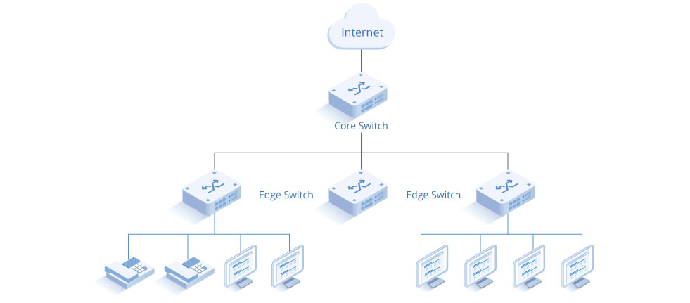

# Internet

## 📚Mạng máy tính

**Mạng máy tính (computer network)** là một hệ thống bao gồm các máy tính và các thiết bị khác (như máy in, bộ định tuyến, thiết bị lưu trữ, v.v.) được kết nối với nhau để chia sẻ dữ liệu và tài nguyên. Các thiết bị trong mạng máy tính có thể giao tiếp với nhau thông qua các phương tiện truyền dẫn (dây dẫn, không dây) và theo các giao thức quy định.

Thành phần chính:
- **Thiết bị đầu cuối (End devices)**: Các máy tính, điện thoại, máy in, hoặc bất kỳ thiết bị nào có thể gửi và nhận thông tin trong mạng.

- **Các thiết bị trung gian (Intermediary devices)**: Bao gồm các bộ định tuyến (routers), bộ chuyển mạch (switches), và các điểm truy cập (access points), giúp kết nối các thiết bị đầu cuối lại với nhau và điều phối quá trình truyền dữ liệu.

- **Phương tiện truyền dẫn (Transmission media)**: Là các loại cáp (cáp xoắn đôi, cáp đồng trục, cáp quang) hoặc sóng vô tuyến (mạng không dây) được sử dụng để truyền dữ liệu giữa các thiết bị.

- **Giao thức mạng (Network protocols)**: Tập hợp các quy tắc và chuẩn mực mà các thiết bị mạng phải tuân theo để có thể giao tiếp và truyền dữ liệu qua lại. Ví dụ: giao thức TCP/IP, HTTP, FTP, v.v.

Phân loại:
- **PAN (Personal Area Network)**: Mạng cá nhân với phạm vi rất nhỏ, ví dụ như kết nối giữa một máy tính và điện thoại qua Bluetooth.

- **LAN (Local Area Network)**: Mạng cục bộ, thường được sử dụng trong một khu vực nhỏ như văn phòng, tòa nhà. Các thiết bị trong mạng LAN thường được kết nối bằng cáp Ethernet hoặc qua Wi-Fi.

- **WAN (Wide Area Network)**: Mạng diện rộng, kết nối các mạng LAN ở các vị trí xa nhau, có thể giữa các thành phố hoặc quốc gia. Internet là ví dụ điển hình của WAN.

- **MAN (Metropolitan Area Network)**: Mạng đô thị, có phạm vi lớn hơn LAN nhưng nhỏ hơn WAN, thường bao phủ một thành phố hoặc khu vực đô thị.

Những giao thức chính: TCP/IP, HTTP/HTTPS, FTP, DNS (sẽ được nói cụ thể từng mục)

## 📚Internet of Things (IoT)

**Internet of Things (IoT)** là một hệ thống các thiết bị vật lý (như cảm biến, thiết bị điện tử, máy móc, xe cộ, v.v.) được kết nối với nhau qua Internet để thu thập và trao đổi dữ liệu mà không cần sự can thiệp của con người. Các thiết bị IoT có khả năng cảm nhận, ghi nhận dữ liệu từ môi trường, gửi dữ liệu về các hệ thống quản lý hoặc đến các thiết bị khác, giúp tạo ra một hệ thống tự động và thông minh.

Thành phần chính:
- **Thiết bị (Devices)**: Các thiết bị vật lý được trang bị các cảm biến và bộ điều khiển để tương tác với môi trường xung quanh. Ví dụ bao gồm máy cảm biến nhiệt độ, thiết bị đo độ ẩm, hệ thống điều khiển nhà thông minh, và xe tự hành.

- **Kết nối (Connectivity)**: Các thiết bị IoT cần kết nối với Internet hoặc các thiết bị khác để truyền tải dữ liệu. Các phương thức kết nối có thể bao gồm Wi-Fi, Bluetooth, Zigbee, LoRaWAN, và mạng di động (như 4G/5G).

- **Nền tảng IoT (IoT Platforms)**: Nền tảng IoT là phần mềm hoặc dịch vụ cho phép quản lý, lưu trữ và phân tích dữ liệu từ các thiết bị IoT. Ví dụ: AWS IoT, Microsoft Azure IoT Hub, Google Cloud IoT.

- **Dữ liệu (Data)**: Dữ liệu được thu thập từ các thiết bị IoT (như nhiệt độ, chuyển động, ánh sáng, v.v.) sẽ được xử lý và phân tích để cung cấp các thông tin hữu ích, giúp đưa ra quyết định thông minh.

- **Ứng dụng (Applications)**: Các ứng dụng IoT xử lý dữ liệu và cung cấp thông tin hữu ích cho người dùng hoặc hệ thống tự động. Ví dụ: ứng dụng nhà thông minh, quản lý giao thông, theo dõi sức khỏe từ xa, và quản lý nông nghiệp thông minh.

Giao thức: MQTT (Message Queuing Telemetry Transport), CoAP (Constrained Application Protocol), Zigbee (sẽ được nói cụ thể từng mục)

## 📚Mạng lõi và biên (core and edge)

### 📙Mạng lõi (Core Network)

**Mạng lõi** là phần trung tâm của một mạng lớn, có nhiệm vụ **vận chuyển dữ liệu giữa các mạng biên** và xử lý các tác vụ quan trọng như **định tuyến** và **quản lý lưu lượng**. Mạng lõi thường bao gồm các thiết bị mạnh mẽ như **router** và **switch** cấp cao, được tối ưu hóa để truyền tải dữ liệu với độ trễ thấp và tốc độ cao giữa các phần khác nhau của mạng.

Chức năng chính:
- **Định tuyến dữ liệu**: Mạng lõi có vai trò chính trong việc định tuyến các gói tin từ một mạng biên này sang một mạng biên khác, đảm bảo rằng dữ liệu đến đúng đích.

- **Tối ưu hóa lưu lượng**: Mạng lõi cần có khả năng xử lý khối lượng lớn dữ liệu và tối ưu hóa đường truyền để đảm bảo rằng các tài nguyên được phân bổ hợp lý.

- **Độ tin cậy cao**: Vì mạng lõi đóng vai trò quan trọng trong việc duy trì hoạt động toàn bộ mạng, nên nó được thiết kế với độ tin cậy cao, với các cơ chế dự phòng và tính sẵn sàng cao (high availability).

Đặc điểm:
- **Tốc độ và băng thông cao**: Mạng lõi cần có băng thông lớn để xử lý các lưu lượng dữ liệu lớn từ nhiều mạng biên.

- **Độ trễ thấp**: Mạng lõi thường phải đảm bảo truyền dữ liệu với độ trễ thấp để đảm bảo hiệu suất và trải nghiệm của người dùng cuối.

- **Tập trung vào việc định tuyến**: Mạng lõi không thực hiện các chức năng liên quan trực tiếp đến người dùng cuối (như xử lý các dịch vụ hoặc ứng dụng); thay vào đó, nó tập trung vào việc chuyển tiếp dữ liệu giữa các phần khác của mạng.

### 📙Mạng biên (Edge Network)

**Mạng biên** là phần mạng gần với người dùng cuối nhất, nơi các thiết bị đầu cuối (như máy tính, điện thoại thông minh, và các thiết bị IoT) kết nối với mạng. Mạng biên cũng có thể được hiểu là phần mạng nằm giữa các thiết bị người dùng và mạng lõi, nơi mà dữ liệu từ người dùng được xử lý và chuẩn bị để gửi vào mạng lõi.

Chức năng chính:
- **Kết nối người dùng cuối**: Mạng biên giúp kết nối các thiết bị người dùng cuối với mạng lõi hoặc Internet. Nó đóng vai trò là điểm truy cập cho các thiết bị trong các hệ thống mạng lớn.

- **Xử lý dữ liệu cục bộ**: Mạng biên ngày càng có xu hướng xử lý dữ liệu ngay tại chỗ trước khi gửi vào mạng lõi để giảm tải cho mạng lõi và cải thiện hiệu suất. Đây là nền tảng của khái niệm **Edge Computing**.

- **Giao tiếp với mạng lõi**: Mạng biên giao tiếp với mạng lõi để gửi các yêu cầu hoặc dữ liệu mà nó không thể xử lý cục bộ.

Đặc điểm:
- **Tập trung vào các dịch vụ người dùng**: Mạng biên thường cung cấp các dịch vụ và ứng dụng mà người dùng cuối truy cập như mạng Wi-Fi, 5G, các điểm truy cập (access points), và các máy chủ biên.

- **Giảm độ trễ**: Để cải thiện trải nghiệm người dùng, mạng biên thường được tối ưu hóa để xử lý một phần dữ liệu gần với người dùng, giúp giảm độ trễ khi tương tác với dịch vụ hoặc ứng dụng.

- **Khả năng tính toán phân tán**: Với sự phát triển của **Edge Computing**, mạng biên có thể thực hiện tính toán ngay tại biên, trước khi truyền dữ liệu vào mạng lõi hoặc đám mây. Điều này giúp giảm tải cho mạng lõi và cải thiện hiệu suất.

### 📙Cách thức hoạt động

Trong một mạng lớn (như mạng Internet hoặc mạng của một nhà cung cấp dịch vụ), người dùng cuối kết nối tới mạng thông qua các thiết bị biên. Dữ liệu từ các thiết bị này được mạng biên xử lý sơ bộ và sau đó chuyển tới mạng lõi để định tuyến và xử lý sâu hơn.



### 📙Edge Computing

**Edge Computing** là một kiến trúc tính toán phân tán, trong đó các tác vụ xử lý dữ liệu được thực hiện gần nguồn dữ liệu, tức là gần với các thiết bị đầu cuối (như cảm biến, thiết bị IoT, điện thoại thông minh, máy tính) thay vì truyền tải dữ liệu tới một trung tâm dữ liệu xa. Điều này giúp giảm độ trễ, tiết kiệm băng thông, và cải thiện hiệu suất tổng thể của các ứng dụng và dịch vụ.

Lợi ích:
- **Giảm độ trễ**: Bằng cách xử lý dữ liệu gần nguồn, Edge Computing có thể giảm đáng kể thời gian phản hồi, điều này rất quan trọng cho các ứng dụng cần thời gian thực như xe tự lái, game online, hay các ứng dụng AR/VR.

- **Tiết kiệm băng thông**: Chỉ các dữ liệu quan trọng hoặc đã được xử lý mới được gửi tới đám mây hoặc trung tâm dữ liệu, giúp tiết kiệm băng thông và chi phí liên quan.

- **Tăng cường bảo mật**: Bằng cách xử lý dữ liệu cục bộ, Edge Computing có thể giảm thiểu nguy cơ dữ liệu bị đánh cắp trong quá trình truyền tải, đồng thời cho phép thực hiện các biện pháp bảo mật tại từng thiết bị.

- **Khả năng xử lý cục bộ**: Các thiết bị tại biên có thể xử lý các tác vụ cục bộ mà không cần phụ thuộc hoàn toàn vào kết nối mạng, điều này đặc biệt quan trọng trong các môi trường có kết nối không ổn định.

*❗Tóm lại thì **Edge Computing** sẽ thực hiện việc tính toán và xử lý ngay tại thiết bị đầu cuối (nơi gần dữ liệu) trước khi gửi đi. Chỉ những dữ liệu quan trọng hoặc đã được xử lý sơ bộ mới được gửi đi, điều này cải thiện hiệu suất của các ứng dụng yêu cầu xử lý thời gian thực.*

## 📚Internet Service Provider (ISP)

**ISP (Internet Service Provider)** là một tổ chức hoặc công ty cung cấp dịch vụ kết nối Internet cho cá nhân, doanh nghiệp và các tổ chức khác. ISPs có vai trò quan trọng trong việc giúp người dùng truy cập vào mạng Internet và cung cấp các dịch vụ liên quan đến Internet.

Chức năng của ISP
- **Kết nối Internet**: ISP cung cấp kết nối đến Internet thông qua các công nghệ khác nhau như DSL, cáp quang, cáp đồng trục, không dây (Wi-Fi) hoặc vệ tinh.

- **Cung cấp địa chỉ IP**: Khi khách hàng kết nối với Internet, ISP sẽ cấp cho họ một địa chỉ IP (Internet Protocol) duy nhất, cho phép họ nhận và gửi dữ liệu trên mạng.

- **Dịch vụ lưu trữ**: Một số ISP cũng cung cấp dịch vụ lưu trữ web, cho phép người dùng lưu trữ trang web và nội dung trên máy chủ của họ.

- **Dịch vụ email**: Nhiều ISP cung cấp dịch vụ email miễn phí cho người dùng của họ, bao gồm cả địa chỉ email và không gian lưu trữ.

- **Bảo mật và hỗ trợ kỹ thuật**: ISP thường cung cấp các dịch vụ bảo mật như tường lửa (firewall), phần mềm diệt virus, cũng như hỗ trợ kỹ thuật cho khách hàng khi gặp sự cố kết nối.

Các loại ISP
- **ISP lớn (Tier 1)**: Là các nhà cung cấp dịch vụ Internet lớn nhất, có khả năng kết nối trực tiếp với các mạng khác mà không cần phải mua băng thông từ các ISP khác. Họ xây dựng và duy trì hạ tầng mạng lớn.

- **ISP cấp hai (Tier 2)**: Là các nhà cung cấp dịch vụ có thể mua băng thông từ ISP cấp một và bán lại cho khách hàng. Họ thường cung cấp kết nối đến các khu vực cụ thể và có thể có các liên kết với các ISP khác.

- **ISP cấp ba (Tier 3)**: Là các nhà cung cấp dịch vụ nhỏ hơn, thường cung cấp dịch vụ cho người dùng cá nhân hoặc doanh nghiệp nhỏ. Họ mua băng thông từ các ISP cấp hai hoặc một và bán lại cho khách hàng của mình.

## 📚Giao thức (Protocol)

**Giao thức (Protocol)** trong mạng máy tính là **tập hợp các quy tắc và quy ước** giúp các thiết bị mạng có thể giao tiếp và truyền tải dữ liệu một cách chính xác và nhất quán. Các giao thức đảm bảo rằng dữ liệu được gửi và nhận theo một trình tự và định dạng mà cả hai bên đều hiểu, bất kể thiết bị của họ khác nhau như thế nào. Nó quy định các quy tắc về:

- **Cấu trúc dữ liệu**: Định nghĩa cách dữ liệu được đóng gói, truyền tải, và giải mã.

- **Thứ tự truyền**: Xác định thứ tự dữ liệu phải được gửi và nhận.

- **Phản hồi**: Quy định cách thức phản hồi nếu một phần dữ liệu bị mất, hoặc nếu có lỗi xảy ra.

Chức năng:
- **Phân chia và tái hợp dữ liệu**: Khi một lượng lớn dữ liệu cần truyền đi, giao thức chia nhỏ dữ liệu đó thành các gói tin nhỏ, sau đó tái hợp chúng lại khi đến đích.

- **Kiểm soát lưu lượng**: Giao thức giúp điều chỉnh lưu lượng để tránh tình trạng tắc nghẽn mạng, đảm bảo các thiết bị không bị quá tải dữ liệu.

- **Kiểm tra lỗi**: Giao thức có thể phát hiện và sửa lỗi khi truyền dữ liệu, đảm bảo rằng dữ liệu đến nơi không bị sai lệch so với bản gốc.

- **Kết nối và duy trì kết nối**: Một số giao thức thiết lập kết nối giữa các thiết bị và duy trì kết nối trong suốt quá trình truyền dữ liệu.

Phân loại:
- Giao thức tầng ứng dụng (Application Layer Protocols): HTTP/HTTPS (HyperText Transfer Protocol), FTP (File Transfer Protocol), SMTP (Simple Mail Transfer Protocol), DNS (Domain Name System)

- Giao thức tầng vận chuyển (Transport Layer Protocols): TCP (Transmission Control Protocol), UDP (User Datagram Protocol)

- Giao thức tầng mạng (Network Layer Protocols): IP (Internet Protocol), ICMP (Internet Control Message Protocol)

- Giao thức tầng liên kết dữ liệu (Data Link Layer Protocols): Ethernet, Wi-Fi (Wireless Fidelity)

*❗Hiểu đơn giản mỗi khi cần kết nối hay chuyển tiếp qua các tầng mạng thì cần có 1 chuẩn quy định chung để đảm bảo sự tương thích và khi đó ta cần có **giao thức**.*

## 📚Kiến trúc tầng (Layered Architecture)

### 📙Mô hình OSI (Open Systems Interconnection)

**Mô hình OSI** được phát triển bởi **Tổ chức Tiêu chuẩn hóa Quốc tế (ISO)** vào cuối những năm 1970. Mô hình này là một khung lý thuyết để mô tả cách các hệ thống mạng truyền tải và nhận dữ liệu thông qua một cấu trúc phân tầng.

Cấu trúc:
- **Tầng vật lý (Physical Layer)**:
    - Chịu trách nhiệm về việc truyền dữ liệu thô (bits) qua các phương tiện vật lý như cáp đồng, cáp quang, sóng radio...

    - Các thiết bị ở tầng này bao gồm: cáp, hub, repeater.

- **Tầng liên kết dữ liệu (Data Link Layer)**:
    - Đảm bảo việc truyền tải dữ liệu giữa các thiết bị liền kề trong mạng, xử lý các vấn đề liên quan đến kiểm soát lỗi và kiểm soát luồng.
    
    - Các giao thức: Ethernet, PPP.
    
    - Thiết bị: switch, bridge.

- **Tầng mạng (Network Layer)**:
    - Chịu trách nhiệm định tuyến dữ liệu từ nguồn đến đích thông qua các mạng khác nhau. Cung cấp địa chỉ IP và quyết định đường đi cho các gói tin.
    
    - Giao thức: IP (IPv4, IPv6), ICMP.
    
    - Thiết bị: router.

- **Tầng vận chuyển (Transport Layer)**:
    - Đảm bảo rằng dữ liệu được truyền chính xác, đầy đủ và theo đúng thứ tự. Nó có thể sử dụng giao thức kết nối (TCP) hoặc không kết nối (UDP).
    
    - Giao thức: TCP, UDP.

- **Tầng phiên (Session Layer)**:
    - Quản lý các phiên giao tiếp giữa hai hệ thống. Tầng này mở, quản lý và kết thúc các phiên kết nối giữa hai thiết bị.

- **Tầng trình diễn (Presentation Layer)**:
    - Đảm bảo dữ liệu được chuyển đổi sang định dạng mà tầng ứng dụng hoặc người dùng có thể hiểu. Nó thực hiện các chức năng mã hóa và giải mã, nén và giải nén dữ liệu.

- **Tầng ứng dụng (Application Layer)**:
    - Đây là tầng gần nhất với người dùng. Tầng này cung cấp giao diện và các dịch vụ để các ứng dụng có thể giao tiếp qua mạng.
    
    - Giao thức: HTTP, FTP, SMTP, DNS.
  
Chức năng:
- Phân chia các tác vụ mạng thành các tầng riêng biệt để dễ dàng quản lý, triển khai và sửa chữa.

- Cung cấp một khung lý thuyết để phát triển các giao thức mới, tương thích và không phụ thuộc vào phần cứng.

- Khả năng chuẩn hóa, giúp các nhà cung cấp khác nhau phát triển sản phẩm tương thích với nhau.

### 📙Mô hình TCP/IP

**Mô hình TCP/IP** được phát triển vào cuối những năm 1970 bởi **DARPA (Cơ quan Dự án Nghiên cứu Quốc phòng Hoa Kỳ)** và được sử dụng rộng rãi cho mạng Internet hiện nay. Nó được coi là một mô hình thực tế và dựa trên các giao thức đã được ứng dụng trong thực tế.

Cấu trúc:
- **Tầng liên kết (Link Layer)**:
    - Tương đương với tầng vật lý và tầng liên kết dữ liệu trong mô hình OSI.
    
    - Xử lý việc truyền tải dữ liệu trong mạng cục bộ, kết nối trực tiếp các thiết bị liền kề.
    
    - Giao thức: Ethernet, Wi-Fi.

- **Tầng Internet (Internet Layer)**:
    - Tương đương với tầng mạng của mô hình OSI. Xử lý việc định tuyến các gói tin từ nguồn đến đích qua các mạng khác nhau.

    - Giao thức: IP, ICMP, ARP.

- **Tầng vận chuyển (Transport Layer)**:
    - Giống với tầng vận chuyển của mô hình OSI. Đảm bảo dữ liệu được truyền chính xác giữa hai hệ thống.

    - Giao thức: TCP, UDP.

- **Tầng ứng dụng (Application Layer)**:
    - Tương đương với tầng ứng dụng, trình diễn, và phiên của mô hình OSI. Cung cấp các dịch vụ và giao thức để các ứng dụng tương tác với nhau qua mạng.

    - Giao thức: HTTP, FTP, SMTP, DNS, Telnet.

Chức năng:
- Được thiết kế để hoạt động trong thực tế với các giao thức cụ thể như TCP và IP.

- Đơn giản hơn mô hình OSI, chỉ có 4 tầng và ít phân tầng chi tiết hơn.

- Được phát triển với mục đích phục vụ mạng Internet, nên có tính thực tiễn cao và dễ triển khai.

### 📙So sánh OSI và TCP/IP

| Tiêu chí         | Mô hình OSI                                       | Mô hình TCP/IP                                     |
| ---------------- | ------------------------------------------------- | -------------------------------------------------- |
| Số tầng          | 7 tầng                                            | 4 tầng                                             |
| Tính thực tiễn   | Mang tính lý thuyết, không được sử dụng rộng rãi. | Được sử dụng rộng rãi trong Internet và mạng LAN.  |
| Phát triển       | Do ISO phát triển, tập trung vào chuẩn hóa.       | Do DARPA phát triển, tập trung vào tính thực tiễn. |
| Giao thức        | Không định nghĩa các giao thức cụ thể.            | Định nghĩa cụ thể các giao thức như TCP, IP.       |
| Tính phân tầng   | Phân chia chi tiết thành 7 tầng.                  | Gộp lại thành 4 tầng, dễ áp dụng hơn.              |
| Tính tương thích | Đưa ra khung để phát triển các giao thức mới.     | Được xây dựng trên các giao thức đã có sẵn.        |
| Chức năng        | Mô tả chi tiết chức năng của từng tầng.           | Tập trung vào truyền tải và kết nối mạng.          |

*❗**Mô hình OSI**: Chủ yếu mang tính lý thuyết, cung cấp một cái nhìn chi tiết về cách mạng máy tính hoạt động, với 7 tầng phân tách rõ ràng. Mô hình này thường được sử dụng trong việc giảng dạy và nghiên cứu.*

*❗**Mô hình TCP/IP**: Đơn giản hơn và mang tính thực tiễn cao, được áp dụng rộng rãi trong các mạng hiện đại, đặc biệt là Internet.*

## 📚Chuyển mạch

### 📙Chuyển mạch gói (Packet Switching)

Trong **chuyển mạch gói**, dữ liệu được chia thành nhiều gói nhỏ (packets) và mỗi gói này được truyền đi độc lập qua mạng. Các gói tin có thể đi qua các đường khác nhau để đến đích, và sau đó được tập hợp lại theo đúng thứ tự tại điểm đích. Mỗi gói tin chứa không chỉ dữ liệu mà còn các thông tin điều khiển như địa chỉ nguồn, địa chỉ đích và số thứ tự gói để đảm bảo chúng được ghép lại đúng cách.

Đặc điểm:
- Không cần thiết lập kết nối cố định: Dữ liệu được gửi ngay lập tức mà không cần thiết lập kênh cố định.

- Linh hoạt: Các gói có thể đi qua nhiều đường khác nhau để đến đích, tùy thuộc vào tình trạng mạng tại thời điểm truyền.

- Chia sẻ tài nguyên mạng: Băng thông và các tài nguyên mạng được chia sẻ giữa nhiều kết nối. Điều này giúp mạng sử dụng tài nguyên hiệu quả hơn.

- Độ trễ thay đổi: Do các gói tin có thể đi qua nhiều đường khác nhau, thời gian đến đích của từng gói tin có thể khác nhau.

Ưu điểm:
- Sử dụng hiệu quả tài nguyên mạng: Tài nguyên mạng không bị chiếm dụng bởi một kết nối duy nhất, các kết nối khác vẫn có thể truyền dữ liệu qua cùng một đường.

- Linh hoạt và bền bỉ: Nếu một đường truyền gặp sự cố, các gói có thể chọn đường khác để đến đích.

- Tính mở rộng cao: Dễ dàng mở rộng mạng và kết nối thêm nhiều thiết bị mà không cần tăng đáng kể tài nguyên mạng.

Nhược điểm:
- Độ trễ không đều: Các gói tin có thể đến đích với độ trễ khác nhau, dẫn đến hiện tượng **jitter** (gói tin đến không đều).

- Khả năng mất gói: Nếu có tắc nghẽn mạng hoặc sự cố, các gói tin có thể bị mất và phải gửi lại, điều này có thể gây chậm trễ.

- Chất lượng dịch vụ không đảm bảo: Vì mạng chia sẻ tài nguyên, chất lượng dịch vụ có thể không được đảm bảo như trong chuyển mạch kênh.

Ứng dụng:
- Internet: Toàn bộ dữ liệu trên Internet (như email, web, video trực tuyến) được truyền tải qua chuyển mạch gói. Giao thức chính là IP (Internet Protocol).

- Mạng truyền dữ liệu hiện đại: Bao gồm các mạng LAN, WAN và mạng di động hiện đại.

### 📙Chuyển mạch kênh (Circuit Switching)

Trong **chuyển mạch kênh**, trước khi truyền dữ liệu, một kênh cố định hoặc đường dẫn sẽ được thiết lập giữa bên gửi và bên nhận. Kênh này được duy trì trong suốt quá trình truyền dữ liệu và tất cả dữ liệu sẽ đi qua cùng một đường. Kênh này giống như một đường dây riêng dành riêng cho các thiết bị giao tiếp cho đến khi quá trình truyền dữ liệu hoàn tất. Khi việc truyền tải hoàn tất, kênh sẽ bị đóng.

Đặc điểm:
- Thiết lập kết nối: Phải thiết lập kết nối cố định trước khi bắt đầu truyền dữ liệu. Kết nối này là liên tục trong suốt quá trình truyền dữ liệu.

- Đường dẫn cố định: Dữ liệu được truyền qua một kênh cố định và không thay đổi cho đến khi truyền xong.

- Tài nguyên dành riêng: Tài nguyên của mạng (băng thông) được dành riêng cho kết nối này trong suốt thời gian truyền.

- Độ trễ thấp: Sau khi thiết lập kết nối, vì không có sự chia sẻ tài nguyên mạng giữa các kết nối khác.

Ưu điểm:
- Độ tin cậy cao: Kết nối cố định, đường truyền ổn định.

- Độ trễ thấp: Vì toàn bộ dữ liệu đều đi qua cùng một kênh, không phải chuyển đổi qua nhiều nút mạng.

Nhược điểm:
- Tốn tài nguyên: Kênh được dành riêng ngay cả khi không truyền dữ liệu (ví dụ khi có khoảng dừng trong cuộc gọi điện thoại).

- Không linh hoạt: Nếu một phần của kênh bị hỏng, toàn bộ kết nối bị ảnh hưởng.

- Thiết lập lâu hơn: Cần thiết lập kết nối trước khi truyền dữ liệu.

Ứng dụng:
- Điện thoại truyền thống (PSTN): Khi thực hiện một cuộc gọi điện thoại, hệ thống sẽ thiết lập một kênh cố định giữa hai máy, và kênh này sẽ duy trì cho đến khi cuộc gọi kết thúc.

### 📙So sánh chuyển mạch gói và chuyển mạch kênh

| Tiêu chí          | Chuyển mạch kênh (Circuit Switching)                    | Chuyển mạch gói (Packet Switching)                           |
| ----------------- | ------------------------------------------------------- | ------------------------------------------------------------ |
| Thiết lập kết nối | Phải thiết lập kết nối cố định trước khi truyền dữ liệu | Không cần thiết lập kết nối, dữ liệu được chia thành các gói |
| Tài nguyên mạng   | Tài nguyên được dành riêng trong suốt kết nối           | Tài nguyên được chia sẻ giữa nhiều kết nối                   |
| Đường truyền      | Dữ liệu đi qua một đường cố định                        | Các gói có thể đi qua các đường khác nhau                    |
| Độ trễ            | Độ trễ thấp sau khi thiết lập kênh                      | Độ trễ thay đổi, có thể cao do chia sẻ tài nguyên            |
| Mất gói dữ liệu   | Không có mất gói, dữ liệu truyền liên tục               | Có khả năng mất gói, đặc biệt khi tắc nghẽn mạng             |

## 📚Băng thông (Bandwidth)

**Băng thông** đề cập đến **lượng dữ liệu tối đa** có thể được truyền qua một kênh truyền (cáp quang, cáp đồng, mạng không dây, v.v.) trong một khoảng thời gian cụ thể.

### 📙Phân loại

**Băng thông danh định (Theoretical Bandwidth)**: Đây là **mức băng thông tối đa** mà một kết nối mạng có thể hỗ trợ theo lý thuyết, dựa trên thông số kỹ thuật của phần cứng hoặc tiêu chuẩn truyền dẫn. Tuy nhiên, tốc độ thực tế thường thấp hơn nhiều so với mức này do các yếu tố như tắc nghẽn mạng, mất gói, hoặc độ trễ.

**Băng thông thực tế (Effective Bandwidth / Throughput)**: Đây là **lượng dữ liệu thực tế** mà người dùng có thể truyền tải qua mạng. **Băng thông thực tế thường nhỏ hơn băng thông danh định**, bị ảnh hưởng bởi các yếu tố như chất lượng thiết bị mạng, số lượng người dùng, và điều kiện môi trường.

**Băng thông đối xứng (Symmetrical Bandwidth)**: Là loại băng thông mà tốc độ tải xuống (download) và tải lên (upload) là như nhau. Điều này thường gặp ở các kết nối mạng quang hoặc trong các dịch vụ Internet doanh nghiệp.

**Băng thông không đối xứng (Asymmetrical Bandwidth)**: Đây là loại băng thông mà tốc độ tải xuống lớn hơn tải lên. Nó phổ biến trong các dịch vụ Internet gia đình vì người dùng thường tải xuống nhiều hơn (xem video, duyệt web) so với tải lên.

### 📙Cách tính

Băng thông thường được đo bằng **bit trên giây (bps)**, nhưng với tốc độ truyền tải dữ liệu ngày càng cao, ta thường gặp các đơn vị lớn hơn:
- 1 Mbps (Megabits per second) = 1 triệu bits trên giây
- 1 Gbps (Gigabits per second) = 1 tỷ bits trên giây
- 1 Tbps (Terabits per second) = 1 nghìn tỷ bits trên giây

### 📙Các yếu tố ảnh hưởng

**Tắc nghẽn mạng (Network Congestion)**: Khi có nhiều thiết bị cùng chia sẻ một kết nối mạng, mỗi thiết bị có thể không nhận được đủ băng thông, dẫn đến chậm mạng.

**Tốc độ thiết bị phần cứng**: Router, modem hoặc các thiết bị mạng khác có thể là *nút cổ chai*, làm giảm băng thông thực tế nếu chúng không đủ khả năng xử lý lưu lượng dữ liệu.

**Khoảng cách và nhiễu**: Đối với mạng không dây, khoảng cách giữa thiết bị và điểm truy cập, cũng như nhiễu từ các thiết bị khác, có thể làm giảm băng thông.

**Giao thức mạng và phương pháp điều khiển**: Một số giao thức hoặc phương pháp quản lý lưu lượng dữ liệu có thể làm giảm hiệu suất, khiến tốc độ mạng chậm đi.

### 📙Băng thông trong các loại mạng

Mạng có dây (Wired Networks):
- **Ethernet**: Hầu hết các mạng Ethernet hiện đại có băng thông **tối thiểu 100 Mbps**, và nhiều mạng cao cấp có thể hỗ trợ lên tới **1 Gbps hoặc 10 Gbps**.

- **Cáp quang**: Có thể cung cấp băng thông rất lớn, **lên đến Tbps** trong các mạng lưới cốt lõi (core networks).

Mạng không dây (Wireless Networks):
- **Wi-Fi**: Với chuẩn Wi-Fi 5 (802.11ac), băng thông lý thuyết có thể đạt **từ 433 Mbps đến 1.3 Gbps**. Wi-Fi 6 (802.11ax) có băng thông thậm chí cao hơn, với tốc độ **lên tới 9.6 Gbps** trong các điều kiện tối ưu.

- Mạng di động (4G/5G): Mạng 4G LTE cung cấp băng thông tối đa khoảng **100 Mbps đến 1 Gbps**, trong khi mạng 5G có thể cung cấp tốc độ **lên đến 10 Gbps hoặc hơn**.

## 📚Tốc độ truyền tải (Throughput)

**Tốc độ truyền tải** là số lượng dữ liệu được truyền thành công qua mạng trong một khoảng thời gian cụ thể.

### 📙Tính chất

**Lượng dữ liệu thực tế**: Throughput phản ánh khả năng xử lý và truyền tải dữ liệu của mạng trong điều kiện thực tế, bao gồm cả các yếu tố như tắc nghẽn mạng, mất gói, và độ trễ.

**Thay đổi theo thời gian**: Tốc độ truyền tải có thể biến đổi theo thời gian do nhiều yếu tố, chẳng hạn như số lượng người dùng truy cập cùng lúc, ứng dụng đang sử dụng, và tình trạng của thiết bị mạng.

### 📙Cách tính

Tốc độ truyền tải thường được đo bằng **bit trên giây (bps)** hoặc các đơn vị lớn hơn.
$$
Throughput = \frac{Total Data Transmitted}{Transmission Time}
$$

Ví dụ: Nếu một file có kích thước 100 MB được truyền trong 10 giây, throughput sẽ được tính như sau:
- Chuyển đổi MB sang bits: 100 MB = 800 Megabits (1 Byte = 8 bits)
- Tính toán throughput:
$$
Throughput = \frac{800 Megabits}{10 seconds} = 80 Mbps
$$
​
### 📙Các yếu tố ảnh hưởng

**Tắc nghẽn mạng**: Khi nhiều người dùng cùng truy cập mạng, lưu lượng tăng cao có thể dẫn đến giảm throughput.

**Chất lượng đường truyền**: Sự suy giảm tín hiệu do nhiễu, khoảng cách giữa các thiết bị, hoặc sự yếu kém của thiết bị mạng có thể làm giảm tốc độ truyền tải.

**Mất gói (Packet Loss)**: Khi dữ liệu bị mất trong quá trình truyền tải, gói tin cần phải được gửi lại, làm giảm throughput tổng thể.

**Độ trễ (Latency)**: Độ trễ cao có thể ảnh hưởng đến khả năng truyền tải, đặc biệt trong các ứng dụng yêu cầu thời gian phản hồi nhanh.

**Giao thức mạng**: Các giao thức khác nhau có cách xử lý và quản lý lưu lượng khác nhau, ảnh hưởng đến throughput.

## 📚Độ trễ (Latency)

**Độ trễ** là thời gian từ khi một gói tin được gửi đi từ thiết bị nguồn cho đến khi nó đến đích.

### 📙Thành phần

**Độ trễ truyền (Transmission Delay)**: Thời gian cần thiết để gửi toàn bộ gói dữ liệu qua môi trường truyền tải. Độ trễ này phụ thuộc vào kích thước gói dữ liệu và băng thông của đường truyền.
$$
Transmission Delay = \frac{Size of the packet}{Bandwidth}
$$

**Độ trễ xử lý (Processing Delay)**: Thời gian mà thiết bị mạng (router, switch) cần để xử lý gói dữ liệu, bao gồm việc kiểm tra, phân tí Thời gian này phụ thuộc vào tốc độ xử lý của thiết bị và các thuật toán được sử dụng.

**Độ trễ xếp hàng (Queueing Delay)**: Thời gian mà gói dữ liệu phải chờ trong hàng đợi ở thiết bị mạng trước khi được xử lý. Độ trễ này thay đổi theo mức độ tắc nghẽn của mạng.

**Độ trễ truyền tải (Propagation Delay)**: Thời gian mà tín hiệu cần để di chuyển qua môi trường truyền dẫn (cáp quang, không khí, v.v.). Độ trễ này phụ thuộc vào tốc độ truyền tín hiệu (thường là tốc độ ánh sáng trong cáp quang) và khoảng cách giữa hai điểm.
$$
Propagation Delay = \frac{Distance}{Propagation Speed}
$$

### 📙Cách tính

**Tổng độ trễ (Total Latency)** là tổng hợp của tất cả các độ trễ. Độ trễ có thể được đo bằng đơn vị thời gian, thường là mili giây (ms).
$$
Total Latency = Transmission Delay + Processing Delay + Queuing Delay + Propagation Delay
$$

Ví dụ: Nếu một gói tin mất 10 ms để truyền tải qua mạng, 5 ms để xử lý tại router, và 2 ms để chờ trong hàng đợi, thì độ trễ tổng cộng sẽ là:
$$
Latency = 10 + 5 + 2 = 17 ms
$$

### 📙Các yếu tố ảnh hưởng

**Khoảng cách vật lý**: Khoảng cách giữa điểm gửi và điểm nhận có ảnh hưởng lớn đến độ trễ. Khoảng cách càng xa, độ trễ càng lớn.

**Chất lượng đường truyền**: Các loại cáp truyền tải và thiết bị mạng khác nhau có thể gây ra độ trễ khác nhau. Cáp quang thường có độ trễ thấp hơn cáp đồng.

**Tình trạng mạng**: Tắc nghẽn mạng, số lượng người dùng truy cập cùng lúc, và tình trạng các thiết bị mạng cũng ảnh hưởng đến độ trễ.

**Cấu hình mạng**: Các yếu tố như cấu hình router, switch, và các thiết lập QoS (Quality of Service) cũng có thể tác động đến độ trễ.

## 📚Tấn công mạng (cyber attacks)

## 📚Phần mềm độc hại (malware)

## 📚Tầng ứng dụng (Application Layer)

**Tầng ứng dụng** là tầng mà người dùng trực tiếp tương tác với, nơi các ứng dụng mạng và giao thức hoạt động để cung cấp dịch vụ cho người dùng cuối. Tầng này thực hiện các chức năng như gửi và nhận dữ liệu, quản lý phiên kết nối, và điều phối các ứng dụng.

Chức năng chính:
- **Quản lý Phiên Kết nối (Session Management)**: Tầng ứng dụng quản lý các phiên kết nối giữa các ứng dụng trên các thiết bị khác nhau, bao gồm việc thiết lập, duy trì và kết thúc phiên.

- **Truyền Tải Dữ liệu (Data Transfer)**: Đảm bảo rằng dữ liệu được truyền tải chính xác và an toàn giữa các ứng dụng, bao gồm cả việc mã hóa và giải mã dữ liệu khi cần thiết.

- **Cung cấp Giao diện cho Người dùng**: Tầng ứng dụng cung cấp giao diện trực quan cho người dùng cuối, cho phép họ tương tác với các ứng dụng một cách dễ dàng.

- **Tương tác với Tầng dưới (Lower Layers)**: Tầng ứng dụng tương tác với các tầng dưới (tầng transport, tầng network, v.v.) để đảm bảo rằng dữ liệu được gửi đi và nhận về một cách hiệu quả.

## 📚Mô hình máy khách - máy chủ (Client-Server Model)

## 📚Mô hình P2P (Peer-to-Peer)

## 📚Giao thức HTTP (Hypertext Transfer Protocol)

**HTTP (HyperText Transfer Protocol)** là giao thức truyền tải siêu văn bản, giao thức HTTP dựa trên **giao thức TCP/IP** nó cho phép lấy về các tài nguyên như văn bản HTML, text, video, ảnh ...

**HTTP** là nền tảng dùng để trao đổi dữ liệu cho các ứng dụng Web với **mô hình Client/Server**

HTTP là **phi trạng thái (stateless)**, có nghĩa không có mối liên hệ nào giữa hai yêu cầu được gửi đi, dù nó là thực hiện trên cùng một kế nối - đến cùng một server.

Do HTTP là stateless nên để cung cấp khả năng chia sẻ trạng thái giữa những request của phiên làm việc cần sử dụng tới **HTTP Cookie**, những dữ liệu nhằm duy trì trạng thái của phiên làm việc, sẽ được thêm vào phần header của HTTP Message

### 📙Các Phiên bản HTTP

**HTTP/1.0** (Phát hành vào năm 1996) : HTTP/1.0 là phiên bản đầu tiên của giao thức HTTP được chính thức chuẩn hóa. Đặc điểm chính:

- **Kết nối ngắn (Non-persistent connections)**: Sau mỗi yêu cầu, kết nối giữa máy khách và máy chủ sẽ bị đóng. Điều này làm tăng thời gian kết nối khi có nhiều yêu cầu.

- **Header đơn giản**: Mỗi yêu cầu chứa thông tin cơ bản như URL, phương thức (GET, POST), và dữ liệu gửi đi.

- Không hỗ trợ tính năng nén hoặc kiểm soát bộ nhớ đệm.

**HTTP/1.1** (Phát hành vào năm 1997) : HTTP/1.1 là phiên bản phổ biến nhất và đã tồn tại trong một thời gian dài. Những cải tiến so với HTTP/1.0:

- **Kết nối dài (Persistent connections)**: Kết nối được duy trì lâu hơn, giảm độ trễ bằng cách cho phép nhiều yêu cầu và phản hồi trong cùng một kết nối.

- **Pipeline**: Cho phép gửi nhiều yêu cầu mà không phải đợi phản hồi của các yêu cầu trước.

- **Nén nội dung**: Hỗ trợ nén để giảm kích thước dữ liệu truyền tải.

- **Kiểm soát bộ nhớ đệm (Caching)**: Hỗ trợ các header giúp cải thiện hiệu quả bộ nhớ đệm.

- **Host header**: HTTP/1.1 thêm header "Host" để hỗ trợ nhiều tên miền trên cùng một máy chủ.

**HTTP/2** (Phát hành vào năm 2015) : HTTP/2 đã mang lại nhiều cải tiến lớn so với HTTP/1.1, đặc biệt về tốc độ và hiệu suất:

- **Multiplexing**: Cho phép nhiều yêu cầu được gửi đồng thời trên cùng một kết nối mà không phải chờ đợi. Điều này cải thiện hiệu suất đáng kể.

- **Nén header (Header compression)**: HTTP/2 sử dụng nén header (HPACK) để giảm kích thước các gói tin, tiết kiệm băng thông.

- **Server push**: Máy chủ có thể gửi trước các tài nguyên mà nó dự đoán sẽ được yêu cầu, giảm thời gian chờ đợi cho người dùng.

- **Binary protocol**: HTTP/2 sử dụng giao thức nhị phân thay vì văn bản như HTTP/1.x, giúp tăng hiệu suất và giảm độ phức tạp trong phân tích cú pháp.

**HTTP/3** (Đang được triển khai, dựa trên QUIC) : HTTP/3 là phiên bản mới nhất của giao thức HTTP và là bước tiến lớn nhờ việc sử dụng QUIC thay vì TCP. QUIC là giao thức truyền dữ liệu được phát triển bởi Google, với các đặc điểm chính:

- **QUIC** thay thế TCP: QUIC là giao thức tầng truyền tải kết hợp giữa UDP và các tính năng của TCP (như quản lý phiên kết nối, kiểm soát lỗi), giảm thời gian thiết lập
  kết nối và độ trễ.

- **Giảm độ trễ**: HTTP/3 giảm thiểu độ trễ khi kết nối mới được thiết lập nhờ QUIC, phù hợp hơn với các ứng dụng di động hoặc mạng không ổn định.

- **Chống nghẽn kết nối (Head-of-line blocking)**: Nếu một gói tin bị mất trong HTTP/2 (TCP), tất cả các yêu cầu khác trên cùng kết nối sẽ phải chờ. QUIC khắc phục vấn đề
  này bằng cách truyền tải không phụ thuộc theo dòng.

- **Cải thiện bảo mật**: HTTP/3 tích hợp mã hóa từ đầu, giúp tăng cường bảo mật mà không cần thiết lập thủ công như trong các phiên bản trước.

So sánh tổng quát

| Tính năng           | HTTP/1.0 | HTTP/1.1 | HTTP/2             | HTTP/3             |
| ------------------- | -------- | -------- | ------------------ | ------------------ |
| Kết nối             | Ngắn     | Dài      | Dài, nhiều yêu cầu | Dài, nhiều yêu cầu |
| Nén dữ liệu         | Không    | Có       | Có (header)        | Có                 |
| Định dạng dữ liệu   | Văn bản  | Văn bản  | Nhị phân           | Nhị phân           |
| Multiplexing        | Không    | Không    | Có                 | Có                 |
| Server Push         | Không    | Không    | Có                 | Có                 |
| Giao thức tầng dưới | TCP      | TCP      | TCP                | QUIC (trên UDP)    |
| Bảo mật tích hợp    | Không    | Không    | Không              | Mã hóa mặc định    |

### 📙HTTP Message

Các yêu cầu (**request hay HTTP Request**) được tạo bởi client (thường là các Web browser như chrome, firefox ...) được gửi đến server http, server sẽ gửi lại dữ liệu (**response hay HTTP Response**) để client nhận được.

Các request, response là các message có cấu trúc đơn giản gọi chung nó là các **HTTP Message**. HTTP Message có thể đọc được mà không nhất thiết phải có công cụ phân tích riêng biệt, nó giảm đi sự phức tạp khi phát triển, kiểm tra ứng dụng.

*❗Hiểu đơn giản **HTTP Message (Thông điệp HTTP)** là các thông tin được trao đổi qua lại giữa client và server.*

Có 2 loại:

- **HTTP Request Message (Request)** được gửi đi bởi client tới server - khi server nhận được nó biết phải thực hiện nhiệm vụ nào đó

- **HTTP Response Message (Response)** là trả lời từ server về cho client


Cấu trúc chung

- Dòng đầu tiên (một dòng): Cho biết thông tin yêu cầu hoặc trạng thái (thành công hay lỗi) của response.

- Phần header (các dòng sau dòng đầu tiên trước một dòng trắng): Nó là một tập hợp các dòng chứa thông tin về HTTP Message, thông tin về phần body

- Một dòng trắng cho biết phần thông tin (dòng đầu và header) đã gửi hết

- Phần body chứa dữ liệu đính kèm với request (như HTML Form) hoặc nội dung văn bản đính kèm cùng response. Kích cỡ dữ liệu này (size) có được xác định bởi thông tin trong header

**_Đọc thêm tại [HTTP Message](https://en.wikipedia.org/wiki/List_of_HTTP_header_fields#General_format)_**

Cấu trúc HTTP Request Message

```bash
GET /index.html HTTP/1.1
Host: example.com
User-Agent: Mozilla/5.0 (Windows NT 10.0; Win64; x64) AppleWebKit/537.36 (KHTML, like Gecko) Chrome/117.0.0.0 Safari/537.36
Accept: text/html,application/xhtml+xml,application/xml;q=0.9,image/avif,image/webp,image/apng,*/*;q=0.8
Accept-Language: en-US,en;q=0.5
Accept-Encoding: gzip, deflate, br
Connection: keep-alive
Upgrade-Insecure-Requests: 1
```
- Dòng đầu tiên: Dòng này chứa thông tin để gửi tới server, dựa vào thông tin này mà server thực thi hành động phù hợp. Dòng này nó có chứa ba thông tin cách nhau bởi khoảng trắng

  - HTTP Method (Phương thức HTTP) là thành phần thứ nhất, nó có giá trị như POST, GET, PUT, DELETE. Nó cho biết yêu cầu cần được thực hiện trên server đối với một tài nguyên nào đó, cụ thể như các phương thức:

    - GET cho biết Request chỉ cần lấy dữ liệu (tài nguyên).
    - POST được sử dụng để cho biết Request là chuyển dữ liệu lên server (thương HTTP Message trường hợp này có kèm dữ liệu như HTML Form ...)
    - PUT ghi đè (thay thế) tài nguyên nào đó bằng dữ liệu trong Request.
    - DELETE xóa tài nguyên
    - HEAD tương tự như GET nhưng chỉ yêu cầu các header mà không lấy body. Thường được sử dụng để kiểm tra tính khả dụng của tài nguyên.

  - Địa chỉ URL - là thành phần thứ hai. Địa chỉ tài nguyên truy vấn, có thể là URL tương đối - tuyệt đối (kể cả cổng, nếu có cổng thì viết cổng sau ký hiệu :)

  - HTTP Version Thành phần thứ ba cho biết phiên bản HTTP

- Header của Request: Các header có cấu trúc đó là một chuỗi là tên header tiếp theo là dấu : và giá trị cho header. Mỗi header được viết trên một dòng. Có rất nhiều loại header (đã chuẩn hóa hoặc header do bạn tự đặt)

- Body của Request: Chứa dữ liệu của Request (dữ liệu này có kiểu xác định ở header Content-Type và độ dài Content-Length), không phải mọi Request đều có body, dữ liệu body thường là HTML Form hay JSON

Cấu trúc HTTP Response Message

```PHP
HTTP/1.1 200 OK
Date: Sun, 06 Oct 2024 09:00:00 GMT
Server: Apache/2.4.29 (Ubuntu)
Last-Modified: Mon, 01 Oct 2024 12:00:00 GMT
Content-Type: text/html
Content-Length: 2345
Connection: keep-alive

<!DOCTYPE html>
<html>
<head>
    <title>Example Page</title>
</head>
<body>
    <h1>Welcome to Example.com!</h1>
    <p>This is a sample webpage.</p>
</body>
</html>
```
- Dòng đầu tiên: còn gọi là dòng trạng thái, nó chứa ba mẩu tin gồm

  - Phiên bản HTTP
  - Mã Trạng thái HTTP (HTTP Status Codes)
    - 1xx (Informational): Chỉ thị rằng yêu cầu đã được nhận và đang xử lý.
    - 2xx (Success): Chỉ thị rằng yêu cầu đã được xử lý thành công. Ví dụ:
        - 200 OK: Yêu cầu thành công.
        - 201 Created: Tài nguyên mới đã được tạo.
    - 3xx (Redirection): Chỉ thị rằng yêu cầu cần được chuyển hướng tới một URL khác.
        - 301 Moved Permanently: Tài nguyên đã chuyển đến một vị trí mới.
    - 4xx (Client Error): Chỉ thị rằng có lỗi từ phía khách hàng.
        - 404 Not Found: Tài nguyên không được tìm thấy.
    - 5xx (Server Error): Chỉ thị rằng có lỗi từ phía máy chủ.
        - 500 Internal Server Error: Máy chủ gặp lỗi không xác định.
  - Đoạn text ngắn giải thích mã ví dụ OK, Not Found, Moved Permanently ...

- Header của Response: tương tự như header của Request

- Body của Response: Chứa dữ liệu của Respone (dữ liệu này có kiểu xác định ở header Content-Type và độ dài Content-Length), không phải mọi Response đều có body


## 📚Cookies và quản lý phiên (Session Management)

## 📚Giao thức FTP (File Transfer Protocol)

## 📚Giao thức SMTP (Simple Mail Transfer Protocol)

## 📚Giao thức truyền phát video và âm thanh

## 📚DNS (Domain Name System)

## 📚Socket Programming


## 📚Tầng vận chuyển (Transport Layer)

## 📚Multiplexing và Demultiplexing

## 📚Điều khiển lưu lượng (Flow Control)

## 📚Điều khiển tắc nghẽn (Congestion Control)

## 📚Truyền dữ liệu đáng tin cậy

### 📙Giao thức ARQ (Automatic Repeat Request)

## 📚Giao thức UDP (User Datagram Protocol)

## 📚Giao thức TCP (Transmission Control Protocol)

---
---


